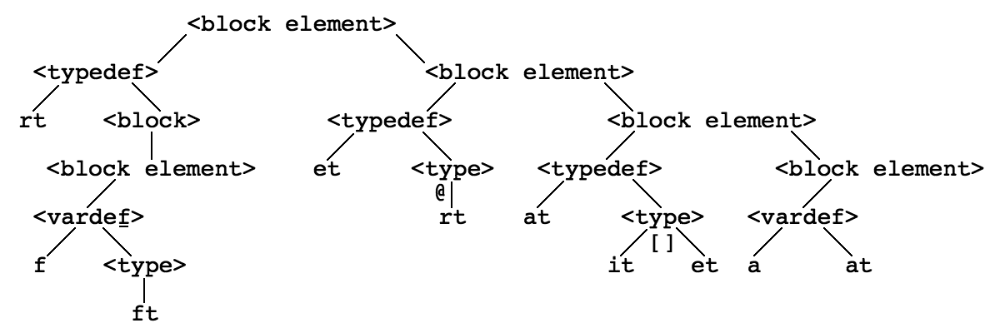
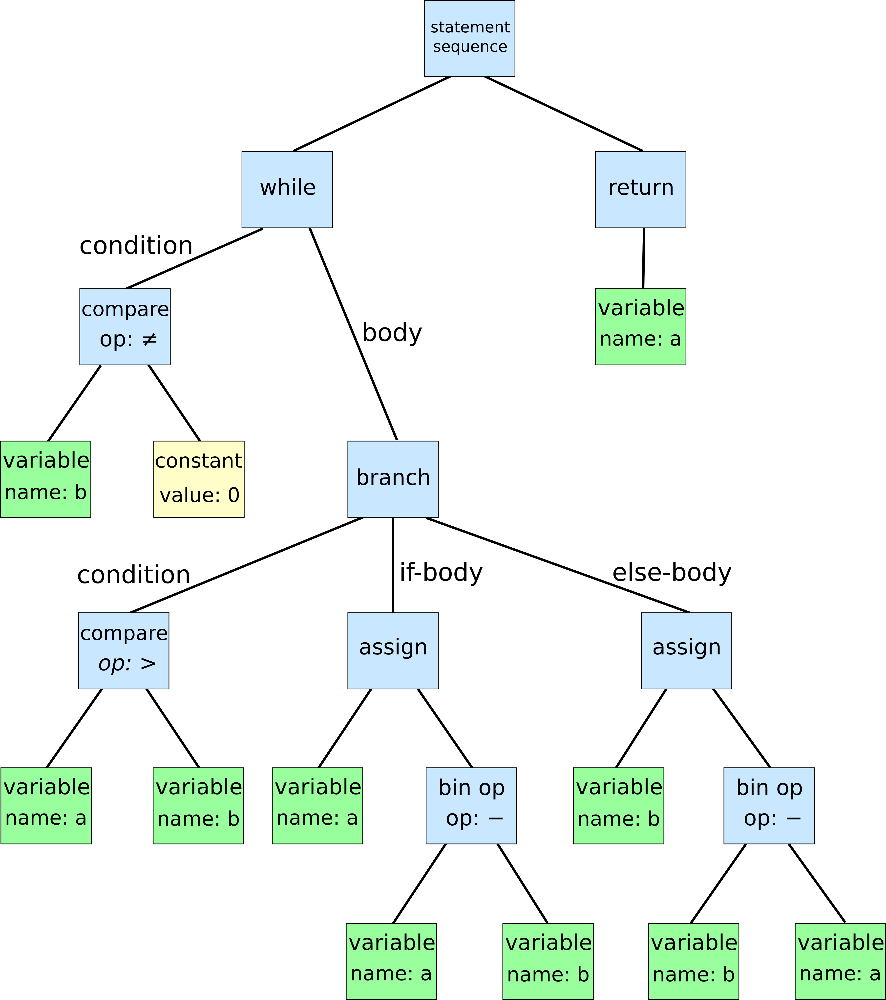
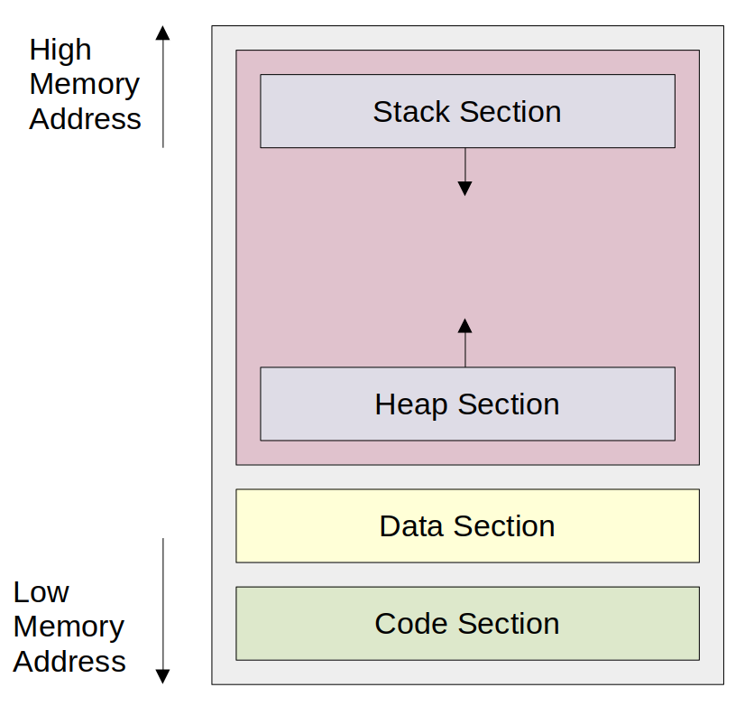

# Chapter 1. 프로그래밍 언어부터 프로그램 실행까지, 이렇게 진행된다.

## 1.1 여러분이 프로그래밍 언어를 발명한다면?


CPU는 0, 1로 구성된 명령어를 사용한다. 이를 `코드(code)`, `소스(source)`라고 한다.

`어셈블리어`를 이용해, 기계어를 인간이 읽고 이해할 수 있는 단어와 대응시킴.

CPU에 특정 작업을 수행을 지시하는, 단도직입적인 명령어를 `문(statement)`이라고 한다.

> 예)  
> 물컵을 찾는다.  
> 오른손을 들어 올린다 등

단계 안에 단계가 중첩되는 것을 `재귀`로 볼 수 있다. 이 재귀 구문에 따라 작성된 코드를 구문 트리(syntax tree)라고 한다.



이 구문 트리를 기계어로 변환하는 과정을 `컴파일`이라고 한다.

그리고 다양한 플랫폼에서 실행할 수 있도록 변환을 위해 `인터프리터(interpreter)`가 사용된다.

## 1.2 컴파일러는 어떻게 동작하는 것일까?


> 고수준 언어를 저수준 언어로 번역하는 프로그램

크게 보면 번역기, 작게 보면 텍스트 처리 프로그램

### 컴파일러의 동작방식

1. 토큰 추출

각 항목을 잘게 쪼갬.

```
T_Keyword    int
T_identifier main
T_Assign     =
T_Semicolon  ;
...
```

왼쪽열은 토큰의 의미(token name)
오른쪽 열은 토큰이 가지는 값(token value)


#### Lexical Analyzer에서 사용하는 용어들 : Token, Lexeme, Pattern
[출처 : Coding Groot](https://coding-groot.tistory.com/17)

| 구분               | 정의                        | 예시                                                                        | 비유                          |
| ---------------- | ------------------------- | ------------------------------------------------------------------------- | --------------------------- |
| **패턴 (Pattern)** | 토큰이 될 수 있는 문자열의 **형태 규칙** | - `"if"`<br>- `[a-zA-Z_][a-zA-Z0-9_]*`<br>- `[0-9]+`                      | **틀(템플릿)**<br>컵의 모양         |
| **렉심 (Lexeme)**  | 소스 코드에서 실제로 **발견된 문자열**   | - `"if"`<br>- `"count"`<br>- `"10"`                                       | **틀로 찍어낸 실제 물건**<br>컵 한 개   |
| **토큰 (Token)**   | 렉심에 부여된 **타입 정보**         | - `(KEYWORD_IF, "if")`<br>- `(IDENTIFIER, "count")`<br>- `(NUMBER, "10")` | **상품 태그가 붙은 물건**<br>컵 + 가격표 |


#### 토큰 인식 과정(Pettern > Lexeme > Token)
```
[소스 코드]
if count > 10

        │
        ▼
[어휘 분석기(Lexical Analyzer)]

───────────────────────────────────────────────
패턴 정의 (규칙)
───────────────────────────────────────────────
KEYWORD_IF     → "if"
IDENTIFIER     → [a-zA-Z_][a-zA-Z0-9_]*
NUMBER         → [0-9]+
COMPARISON_OP  → ">" | "<" | "==" | "!="
───────────────────────────────────────────────

        │
        ▼
[소스 코드에서 문자열 추출 & 매칭]

"if"     → 패턴: "if"                → 토큰: KEYWORD_IF
"count"  → 패턴: IDENTIFIER           → 토큰: IDENTIFIER("count")
">"      → 패턴: COMPARISON_OP        → 토큰: COMPARISON_OP(">")
"10"     → 패턴: NUMBER               → 토큰: NUMBER(10)

        │
        ▼
[최종 토큰 시퀀스]
(KEYWORD_IF, "if")
(IDENTIFIER, "count")
(COMPARISON_OP, ">")
(NUMBER, "10")
```

이러한 토큰을 추출하는 과정을 `어휘 분석(lexical analysis)`이라고 한다.

---

```javascript
while (표현식 ) {
    반복내용
}
```

2.  구문 분석(Syntax Analysis, Parsing)

다음 토큰이 while 키워드에 필요한 토큰이 아니면 `문법 오류(syntax error)`가 발생한다.

이런한 문법오류가 없는지 확인하는 과정을 `해석(parsing)`이라고 한다.

이러한 과정을 통해, `구문트리`가 생성된다.



> 이 트리를 생성하는 전체 과정이 구문 분석이다.

---

3. 의미분석(Semantic analysis)

구문 트리가 생성되고 구문 트리에 이상이 없는지 확인

---

4. 구문 트리를 기반으로 중간 코드 생성

의미 분석이 끝난 후, 구문트리 탐색 결과를 바탕으로 중간코드(Intermediate Representation Code, IR Code)를 생성한다.

---

5. 코드 생성

중간코드를 기계어로 변환하는 과정을 `코드 생성(code generation)`이라고 한다.

코드 생성이 끝난 후, 생성된 기계어를 실행할 수 있도록 병합하는 과정을 `링크(link)`이라고 한다.

이 링크를 담당하는 프로그램을 `링커(linker)`라고 한다.

## 1.3 링커의 말할 수 없는 비밀

압축 프로그램이 파일 여러 개를 하나의 압축 파일로 묶어 주는 것처럼, 컴파일러가 생성한 대상 파일 여러개를 하나로 묶어 `하나의 최종 파일`로 생성한다.

> 링커는 전역 심벌만 사용해 모듈간 연결을 한다.

1. 심볼 결합(Symbol Resolution)

각 오브젝트 파일 안에는 외부 함수/변수가 심볼(symbol)로 표시되어 있음

링커가 심볼 테이블을 보고, 참조된 심볼이 어느 파일/라이브러리에 있는지 찾아 연결

2. 주소 재배치(Relocation)

각 오브젝트 파일은 메모리 주소를 0부터 시작하는 가상의 주소로 가짐

링커가 최종 실행 파일에서 실제 메모리 주소로 수정

3. 라이브러리 결합(Library Linking)

표준 라이브러리(libc), 사용자 라이브러리 등을 불러와 코드에 포함

정적 링크(static linking) 시 실행 파일 안에 코드가 포함됨
동적 링크(dynamic linking) 시 실행 시점에 외부 라이브러리 로드


> 컴파일러는 기계 명령어를 생성할 뿐만 아니라, 명령어를 실행시키는 데이터도 생성한다.

컴파일러는 명령어 부분과 데이터 부분을 분리하여 생성한다.

- 명령어 부분은 소스 파일에 포함된 기계 명령어가 저장되는 부분
- 데이터 부분
    - 전역 변수: 프로그램 전체 동안 항상 메모리에 자리 차지 → 데이터 영역에 고정
    - 지역 변수: 함수 실행 중에만 스택에 잠시 올라왔다가 사라짐 → “항상 저장”되는 곳이 없음

---

### 심벌이란?

전역 변수(global variable)와 함수(function)의 이름을 포함하는 모든 변수 이름

> 지역 변수(local variable)는 모듈 내에서만 사용되어 외부 모듈에서 참조할 수 없기 때문에 링커의 심벌 테이블에 포함되지 않는다.

#### 심벌 테이블

심벌 테이블은 컴파일러나 어셈블러가 변수, 함수, 클래스 등 식별자(Identifier) 정보를 저장하는 자료구조이다.

```c
int g = 10;       // 전역 심벌
void foo(int a) { // foo: 전역 심벌, a: 지역 심벌
    int b = a;    // b: 지역 심벌
}
```

**전역 심벌 테이블**

| 이름  | 종류 | 타입        | 주소/오프셋 |
| --- | -- | --------- | ------ |
| g   | 변수 | int       | 0x1000 |
| foo | 함수 | void(int) | 0x2000 |


**foo 함수의 지역 심벌 테이블**

| 이름 | 종류 | 타입 | 주소/오프셋(스택) |
| --- | -- | -- | ---------------- |
| a   | 매개변수 | int | ebp-8 |
| b   | 변수 | int | ebp-12 |

---

### 정적 라이브러리, 동적 라이브러리, 실행파일

#### 정적 라이브러리

프로그램 빌드 시점에 실행 파일에 통째로 포함되는 라이브러리이다.
즉, 실행 파일이 만들어질 때 라이브러리의 필요한 코드가 복사되어 포함되기 때문에, 실행 시에 외부 라이브러리 파일이 없어도 동작한다.

| 구분         | **정적 라이브러리 (Static Library)**       | **정적 링크 (Static Linking)**      |
| ---------- | ----------------------------------- | ------------------------------- |
| **정의**     | 미리 컴파일된 함수·데이터 묶음 파일                | 정적 라이브러리를 실행 파일에 포함시키는 과정       |
| **형태/확장자** | `.a` (Linux/Unix), `.lib` (Windows) | 과정(동작) 자체이므로 확장자 없음             |
| **생성 시점**  | 라이브러리 제작자가 소스코드를 컴파일해 만듦            | 최종 프로그램 빌드(링크) 시 발생             |
| **역할**     | 재사용 가능한 코드 저장소 역할                   | 실행 파일 생성 시 필요한 라이브러리 코드 복사      |
| **사용 방식**  | 컴파일/링크 시 지정하여 사용 (`-l` 옵션 등)        | 링커가 `.a`/`.lib`에서 필요한 심벌을 찾아 복사 |
| **수정 반영**  | 라이브러리를 다시 만들면 됨                     | 라이브러리 변경 시 프로그램 재빌드 필요          |
| **관련 도구**  | `ar` (Linux), `lib` (Windows)       | `ld` (링커), `gcc -static` 등      |
| **관계**     | 정적 링크 시 사용되는 **대상 파일**              | 정적 라이브러리를 실행 파일에 넣는 **행위**      |

#### 동적 라이브러리

프로그램 실행 시 외부에서 로드되는 라이브러리이다.
실행 파일에는 라이브러리의 참조 정보만 포함되며, 실행 시 해당 라이브러리가 시스템에 존재해야 동작한다.

| 구분             | 동적 라이브러리 (Dynamic Library / Shared Library) | 동적 링크 (Dynamic Linking)                |
| -------------- | ------------------------------------------- | -------------------------------------- |
| **정의**         | 실행 시 외부에서 로드되는 함수·데이터 묶음 파일                 | 실행 시 동적 라이브러리를 메모리에 로드하여 프로그램과 연결하는 과정 |
| **확장자**        | `.so`(Linux), `.dll`(Windows)               | 없음                                     |
| **포함 시점**      | 실행 파일에는 참조 정보만 포함                           | 실행 시 라이브러리 로드                          |
| **실행 시 필요 여부** | 필요함                                         | 필요함                                    |
| **업데이트 반영**    | 라이브러리 교체만으로 적용 가능                           | 라이브러리 교체만으로 적용 가능                      |
| **실행 파일 크기**   | 작음                                          | 작음                                     |
| **메모리 사용**     | 여러 프로그램이 공유 가능                              | 여러 프로그램이 공유 가능                         |
| **장점**         | 파일 크기 작음, 업데이트 쉬움                           | 메모리 공유, 업데이트 쉬움                        |
| **단점**         | 실행 환경에 라이브러리 필요                             | 실행 시 로드 지연 가능                          |

#### 동적 링크의 두가지 방식

1. 프로그램이 메모리에 `적재(loading)`될 때, 동적 링크가 생성된다. 그리고 이 과정에서 `적재 도구(loader)`프로세스가 실행된다. 실행파일이 적재되고 나면 `적재도구는 동적 라이브러리에 의존하는지 여부를 확인한다.`  
동적 라이브러리가 필요하다면, 동적 링커(dynamic liker)라는 별도의 프로세스가 실행되어 참조하는 동적 라이브러리의 존재 여부와 위치, 심벌의 메모리 위치등을 확인하고 링크과정을 마무리 한다.  
동적 링크가 정상적으로 완료되면, 프로그램이 시작된다.  

    > 동적 링크과정에 문제가 발생하면, 오류 메세지를 표시하고 실행이 종료된다. 

2. `적재(loading)` 중 고정적으로 일어나는 동적 링크 외에도 프로그램이 먼저 실행된 후, 프로그램의 실행 시간동안 코드가 직접 동적 링크를 실행할 수 있다.

    > 실행시간이란 CPU가 프로그램을 실행하기 시작한 시점부터 실행이 완료되어 프로그램이 종료된 시점까지의 시간

    `실행시간 동적링크(runtime dynamic linking)`은 실행 파일이 실행될 떄까지 어떤 동적 라이브러리에 의존하는지 알 필요가 없기 때문에 `더 동적`인 방식이다.

    런타임 동적 링크는 링크 과정을 프로그램이 실행된 이후로 미룬다.

    이 방식은, `실행 파일을 생성하는 과정에서 실행 파일 내부에 동적라이브러리 정보가 저장되지 않는다.`

---

#### 동적 라이브러리의 장점

1. 의존하는 프로그램 개수가 많더라도, 디스크에는 동적 라이브러리의 복사본 하나만 저장된다.

    > 메모리 적재와 디스크 저장에 필요한 리소스를 대폭 절약할 수 있다.

2. 동적 라이브러리의 코드가 수정된다고 하더라도, 해당 동적 라이브러리만 다시 컴파일하면 된다.

3. 동적 링크가 실행시간에 일어나는 특성을 이용하여 기능을 쉽게 확장할 수 있는 `플러그인(plug-in)`을 구현한다.
    > 우선 사전에 함수 여러 개를 미리 정의해 두고, 플러그인안에서 이 함수를 구현한 후 플러그인을 적재하여 프로그램이 사용할 수 있도록 한다.

#### 동적 라이브러리의 단점

프로그램이 적재되는 시간 또는 실행 시간에 링크됨에 따라 동적링크를 사용하는 프로그램은 정적링크를 사용할 때보다 성능이 약간 떨어진다.

동적 라이브러리는 메모리에 단 하나의 복사본만 존재하고, 해당 코드는 여러 프로세스가 공유할 수 있기 때문에 동적 라이브러리의 코드는 임의의 메모리 절대 주소(absolute address)를 참조할 수 없다.

> 적재할 때 동적 링크를 수행하는 프로그램은 실행 파일만으로는 실행이 불가능하다.  
> 즉, 종속된 동적 라이브러리를 제공하지 않거나 그 버번이 호환되니 않을 경우 프로그램이 실행되지 않는다.


### 재배치

프로그램 안에서 참조하고 있는 주소를, 실행될 실제 메모리 주소에 맞게 수정하는 과정이다.

---

### 가상 메모리와 프로그램 메모리 구조

링커가 변수의 실행 시간 메모리 주소를 미리 알 수 있는 방법을 해결하기 위해 `가상 메모리(virtual memory)`를 사용한다.

프로그램이 실행되면 `프로그램의 프로세스(process)가 메모리에 적재`된다.




가상메모리는 물리적으로 존재하지 않는 가짜 메모리이다.
프로그램이 실행 중일 때, 자기 자신의 메모리를 모두 독점적으로 사용하고 있는 것처럼 착각하게 만든다.

실행 파일의 코드 영역이 `물리 메모리 주소 0x80ef0000에 적재된다고 가정하면, 시스템에는 사상(mapping)관계가 추가`된다.
실제의 모든 메모리 주소에 대해 이런 사상관계를 유지하는 것은 아니며 `메모리 페이지(memory page)단위로 관리`된다.

가상메모리 0x400000 <-> 물리 메모리 0x80ef0000

이러한 `사상관계를 기록한 표를 페이지 테이블(page table)`이라 한다.  
CPU가 프로그램을 실행하고 `메모리 주소 0x4000000`에 접근하면, 페이지 테이블을 참조하여 `물리 메모리 주소 0x80ef0000으로 변환` 후 접근한다.

---

## 컴퓨터 과학에서 추상화가 중요한 이유

> 추상화는 `표현력을 크게 향상`시키고 `의사소통의 효율`을 올려줄 뿐만 아니라 `세부사항을 노출할 필요가 없으므로 보호`할 수 있다.

추상화는 프로그래머를 저수준 계층에서 멀어지게 만들고, 세부사항도 신경 쓸 필요가 없도록 만든다.

---

## 요약

프로그래머가 작성한 코드는 문자열 나열에 지나지 않는다.  
컴파일러는 번역기 역할을 하여프로그래밍 언어 문법에 따라 코드를 구문 분석하고 최종적으로 기계 명령어를 생성한다.  
컴파일러는 CPU를 세부 사항에서 보호하여 프로그래머가 기계 명령어를 전혀 알지 못해도 프로그래밍을 가능하게 해주는데 이것이 `추상화의 힘`이다.