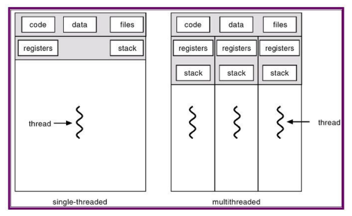
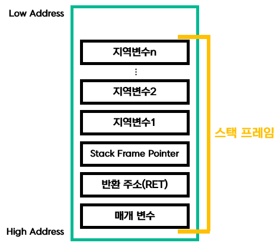

#  프로그램이 실행되었지만, 뭐가 뭔지 하나도 모르겠다.

## 2.1 운영체제, 프로세스, 스레드의 근본 이해하기

CPU는 스레드, 프로세스, 운영체제같은 개념을 알지 못하며, 단지 `메모리에서 명령어(instruction)를 하나 가져오고(dispatch), 실행(execute)을 반복`할 뿐이다.

PC 레지스터(program counter register)는 CPU가 현재 실행 중인 명령어의 주소를 저장한다. 그리고 이 주소를 기준으로 다음 명령어를 가져오기 위해 PC레지스터의 값을 증가시킨다.

작성하는 프로그램의 시작점은 `main함수`이다.  

> CPU는 한번에 한가지 일만 할수 있지만, 여러 프로그램 사이를 빠르게 전환함에 따라, 동시에 실행되는 것처럼 보이게 한다.

---
### 프로세스(process)

`프로세스`는 상황 정보(context)를 저장하고, 프로그램의 필요한 정보를 기록할 수 있는 구조체이다.

프로그램을 자동으로 적재해주고 멀티태스킹을 실현해주는 프로세스 관리 도구를 `운영체제(OS)`라고 한다.


코드 영역(code segment) - 텍스트 영역 : 코드를 컴파일하여 생성된 기계 명령어가 저장

데이터 영역(data segment) : 전역 변수등이 저장

스택 영역(stack segment) : 프로그램이 자동으로 사용하는 임시 메모리 영역. 
함수 호출 시 생성되는 지역 변수와 매개 변수가 저장되는 영역이고, 함수 호출이 완료되면 사라진다. 

힙 영역(heap segment) : 힙 영역은 프로그래머가 직접 공간을 할당, 해제하는 메모리 공간(혹은 Garbage Collector가 대신 처리해준다)  힙 영역은 선입선출(FIFO, First-In First-Out)의 방식으로, 가장 먼저 들어온 데이터가 가장 먼저 인출

### 다중 프로세스

운영체제(OS)가 동시에 여러 개의 프로세스를 실행하고 관리하는 방식  
프로세스 간 통신(IPC: Inter-Process Communication) 기법을 사용해 데이터를 주고받을 수 있음.

#### 다중 프로세스의 단점
1. 프로세스를 생성할 때 큰 부담(overhead)가 걸림
2. 프로세스마다 자체적인 주소 공간을 가지고 있음에 따라, 프로세스간 통신은 프로그래밍하기에 더 복잡함.

---

### 스레드(thread)



하나의 프로세스 안에서 여러 실행 흐름을 가지는 방식

스레드는 프로세스 주소 공간을 공유하여 프로세스보다 훨씬 가볍고 생성 속도가 빠르다.

> 스레드를 `경량 프로세스(light weight process - LWP)`라고도 함.

#### 스레드의 활용

스레드가 처리하는 작업에는 긴 작업(long task)와 짧은 작업(short task)가 있음.

1. 긴 작업 : 매우 긴 시간동안 활동하는 작업
    예) 대용량 파일 읽기/쓰기, 네트워크 요청/응답 대기 (예: 서버에 API 호출), 데이터베이스 질의 실행, 복잡한 이미지 처리, 대규모 연산 (영상 인코딩, 머신러닝 학습 등)

2. 짧은 작업 : 매우 짧은 시간동안 활동하는 작업
    예) 변수 계산, 단순한 수식 처리, GUI 요소 그리기, 버튼 클릭 이벤트 처리, 리스트 정렬이나 필터링 같은 소규모 데이터 처리, 사용자 입력 검증

#### 스레드 풀(thread pool)

> 스레드의 생성과 종료에 많은 시간을 허비하고 리소스를 많이 소비함.  
> 스레드 수가 많으면 스레드 간 전환에 부담이 증가

이에 따라, 스레드 풀이 탄생함.

스레드를 여러개 미리 생성해두고, 스레드가 처리할 작업이 생기면 해당 스레드에 처리를 요청하는 것.  
스레드 여러개가 미리 생성되어 있어 스레스 생성/종료 작업이 빈번하게 발생하지 않고 일정하게 관리됨에 따라 불필요한 메모리 소비가 없음.


`Queue` 형태로 작업이 저장되어 있고, 스레드가 작업을 처리함.

#### 다중 스레드(multi-threading)

스레드 여러 개를 생성하기만 하면 다중 코어를 이용하여 CPU를 최대한 활용할 수 있다.


---

## 스레드 간 공유되는 프로세스 리소스

1. 프로세스는 운영체제가 리소스를 할당하는 기본 단위
2. 스레드는 스케쥴링(scheduling)의 기본 단위

### 스레드 전용 리소스(thread-private resource)

함수 실행에는 하나의 시작점이 존재 > `진입함수`

함수의 실행 정보는 스택 영역을 구성하는 `스택 프레임에 저장`되고, 반환값, 매개변수, 지역변수, 레지스터 정보가 저장됨.



> 각 스레드에는 해당 스레드가 독점적으로 사용하는 스택 영역이 있음.

#### 스레드 상황정보(thread context)

1. 프로그램 카운터(PC, Program Counter)

스레드가 다음에 실행할 명령어의 주소를 저장

2. 레지스터 값들

범용 레지스터(연산에 필요한 값), 상태 레지스터(플래그 비트, 예: carry, zero 등) 등이 포함

스레드가 중단되면 레지스터 상태도 그대로 저장해두어야, 재개 시 이어서 실행이 가능

3. 스택 포인터(Stack Pointer)

현재 스레드의 스택 위치를 가리킴.

함수 호출/리턴, 지역 변수 저장 등과 관련된 중요한 정보

4. 스레드 식별자(TID, Thread ID)

스레드를 구분하기 위한 고유 ID

5. 스케줄링 정보

우선순위, 실행 상태(준비, 실행, 대기), CPU 점유 시간 등 스케줄러가 참고하는 정보

6. 메모리 관련 정보

해당 스레드가 접근할 수 있는 주소 공간과 관련된 정보(페이지 테이블, 세그먼트 등).

> 스레드는 프로세스 주소 공간에서 `스택 영역을 제외하고 나머지 영역을 공유`


---

### 코드 영역:모든 함수를 스레드에 배치하여 실행할 수 있다.

코드영역(텍스트 영역)은 스레드간에 공유되므로, 어떤 함수든지 모두 스레드에 적재하여 실행할 수 있음.

특정함수를 특정 스레드에서만 실행되도록 하는 것은 불가능함.

`프로그램의 올바른 실행을 위해` 코드영역은 `읽기 전용(read-only)`.  

프로그램이 실행되는 동안 어떤 스레드도 내용을 변경할 수 없음.

> 프로세스 내 모든 스레드가 코드영역을 공유하고 있지만, 코드 영역에 관해서만큼은 `스레드 안전 문제(thread-safe issue)`가 발생하지 않음.

---

### 데이터 영역 : 모든 스레드가 데이터 영역의 변수에 접근할 수 있다.

`데이터 영역은 전역 변수`가 저장됨.

> 프로그램이 실행되는 동안 데이터 영역 내의 `전역변수의 인스턴스(instance)`는 하나만 있기 때문에 모든 스레드는 전역변수에 접근할 수 있음.

---

### 힙 영역 : 포인터가 핵심이다.

모든 스레드는 변수 주소`(포인터)`만 알고 있다면, 포인터가 가르키는 곳에 데이터가 접근할 수 있음.

---

### 스택 영역 : 공유 공간 내 전용 데이터

스레드의 추상화 측면에서 `스택 영역은 공유 공간 내 전용 데이터`

별도의 보호를 위한 작동방식이 존재하지 않으므로, 다른 스레드에서 특정 스레드의 스택 영역을 볼 수 있음.,

`스레드 여러 개가 하나의 프로세스에 속하는 경우, 스레드가 다른 스레드의 스택 영역이라고 해도, 데이터를 읽고 쓸 수 있음.`

> 사실상 격리가 이루어 지지 않음에 따라, 편리하지만 문제를 많이 일으킬 수 있음.

---

### 동적 링크 라이브러리와 파일

여유 공간에 `동적 라이브러리의 코드와 데이터`를 배치함.

이 공간은 모든 스레드가 공유함에 따라, 프로세스 내 모든 스레드가 동적 라이브러리 코드의 데이터를 사용할 수 있음.

### 스레드 전용 저장소(thread local storage)

- 이 영역에 저장된 변수는 모든 스레드에서 접근가능
- 변수의 인스턴스는 각각의 스레드에 속함에 따라, 하나의 스레드에서 변수 값을 변경해도 다른 스레드에는 반영되지 않음.

> 각가의 스레드에서 독점적으로 사용할 수 있음.

---

## 스레드 안전 코드는 도대체 어떻게 작성해야 할까?

### 자유와 제약

- 전용 리소스를 사용하는 스레드는 `스레드 안전을 달성`할 수 있음.
- 공유 리소스를 사용하는 스레드는 다른 스레드에 영향을 주지 않도록 하는 `대기 제약 조건`에 맞게 리소스를 사용하면, 스레드 안전을 달성할 수 있음.

---

### 스레드 안전이란 무엇일까?

코드가 스레드 몇개에서 호출되든 결과가 항상 일관되게 나오는 것

```typescript
function sum = () => {
    const a :number = 1;
    const b :number = 1;
    return a + b;
}

// 항상 2만 반환
```

---

### 스레드 전용 리소스와 공유 리소스

함수의 지역 변수, 스레드의 스택 영역, 스레드 전용 저장소는 `스레드 전용 리소스`

그외는 `공유 리소스`
- 힙 영역
- 데이터 영역

> 코드 영역은 `읽기 전용`이므로, 신경쓰지 않아도 됨.

---

### 스레드 전용 리소스만 사용하기

스레드 전용 리소스인 `지역 변수`

이런 코드를 `무상태 함수(stateless function)`라고 함. > `스레드 안전`

> 함수형 프로그래밍에서 말하는 순수함수와 유사해보임.

---

### 스레드 전용 리소스와 함수 매개변수, 전역 변수 사용

함수 매개변수를 `값으로 전달(call by value)`

| 구분       | Call by Value (값 호출)                     | Call by Reference (참조 호출)                       |
| -------- | ---------------------------------------- | ----------------------------------------------- |
| 전달 방식    | **값을 복사**해서 함수로 전달                       | \*\*주소(참조)\*\*를 전달                              |
| 함수 내부 변경 | 원본 변수에 **영향 없음**                         | 원본 변수에 **직접 반영**됨                               |
| 메모리 사용   | 추가 복사본이 필요 → 메모리 사용 증가                   | 복사본 없음 → 메모리 효율적                                |
| 안전성      | 원본 값이 보호됨 (안전)                           | 원본 값이 변경될 수 있어 주의 필요                            |
| 성능       | 작은 데이터에는 유리하지만, 큰 구조체·객체는 복사 비용↑         | 큰 데이터도 주소만 전달하므로 효율적                            |
| 사용 예시    | C의 기본형(int, float), Java의 primitive type | C의 포인터, C++의 참조, Java의 객체, Python의 mutable 객체 등 |


> 전역 변수를 사용할 경우, 프로그램이 실행 후 한번 초기화 되고 나서 `변수를 읽기`만 하면 문제없음.

---

### 스레드 전용 저장소

```c
__thread int global_num = 100;

int func() {
    ++global_num;
    return global_num
}
```

`__thread` 수식어가 붙은 변수는 스레드 전용 저장소에 배치됨.

다른 스레드에 영향을 미치지 않음에 따라, func함수는 스레드 안전

---

### 스레드 안전 코드는 어떻게 구현할까?

- 스레드 전용 저장소(thread local storage)
    -  전용 리소스 사용 시, 스레드 전용 저장소를 선언할 수 있는지 확인
- 읽기 전용( read-only)
    - 전역 리소스를 사용하는 경우, 전용 리소스를 `읽기 전용`으로 사용
- 원자성 연산(atomic operation)
    - `C++ 언어의 std::atomic`형식의 변수처럼 원자성 연산은 도중에 중단되지 않음.
- 동기화 시 상호 배제(mutual exclusion in synchronization)
    - 뮤텍스(mutex), 스핀 잠금(spin lock), 세마포어(semaphore)외에 여러 가지 동기화 시 상호 배제를 위한 작동 방식 모두 사용 고려

---

## 프로그래머는 코루틴을 어떻게 이해해야 할까?

> 코루틴(coroutine)

코루틴은 일반 함수와 다르게 `일시 중지`와 `재개 기능`이 있음.

| 구분     | 코루틴                         | JS 제네레이터                       |
| ------ | --------------------------- | ------------------------------ |
| 개념     | 일반적인 프로그래밍 개념               | JS에서 코루틴 개념을 구현한 것             |
| 정의 키워드 | 언어마다 다름 (예: Python `yield`) | `function*`, `yield`           |
| 실행 제어  | `yield` 지점에서 중단·재개          | `yield` 지점에서 중단·재개             |
| 값 주고받기 | `send()` / `yield` 로 값 교환   | `next(value)` / `yield` 로 값 교환 |
| 활용     | 비동기, 파이프라인, 협력적 멀티태스킹       | 비동기 흐름 제어, 반복자(iterator) 구현    |

> 코루틴이 일반함수와 다른 점은 `자신이 이전에 마지막으로 실행된 위치`를 알 수 있음.

### 코루틴은 어떻게 구현될까?

코루틴의 스택 프레임 정보는 `힙 영역`에 저장된다.

> 코루틴을 통해 프로그래머가 `동기`방식으로 `비동기 프로그래밍`을 가능하게 함.