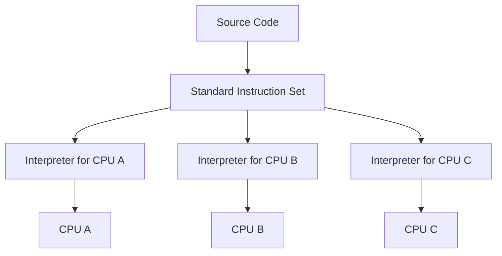
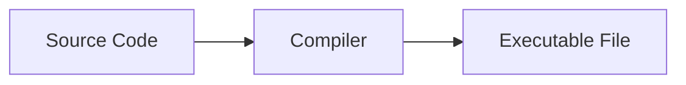

# CHAPTER 1: 프로그래밍 언어부터 프로그램 실행까지, 이렇게 진행된다.

## 1. 여러분이 프로그래밍 언어를 발명한다면?

### 1.1.1 창세기: CPU는 똑똑한 바보
스위치를 조합하면 복잡한 불 논리(boolean logic)를 표현할 수 있다. 이를 기반으로 CPU를 만들었다. 따라서 CPU는 0과 1만 이해한다.
CPU는 데이터를 한곳에서 다른 곳으로 옮기고 간단히 연산한 후 다시 그 데이터를 또 다른 자리로 옮기는 작업을 한다. 이런 작업을 빠른 속도로 처리한다.
> **Note:** CPU는 클럭에 맞춰 동작하며, 클럭 속도는 헤르츠(Hz)로 측정한다.
> 1 GHz는 초당 10^9 **클럭 사이클**을 뜻한다.
> 예컨대 현대 소비자용 CPU는 대략 **기본 2.5–4 GHz, 최대 4–5+ GHz** 수준이며,
> 이는 초당 **수십억 사이클**을 의미한다.

### 1.1.2 어셈블리어 등장
초창기 CPU가 처리한 0과 1은 **기계어**(machine code)다. CPU는 기계어를 이해하고 처리할 수 있다.
하지만 기계어는 사람이 이해하기 어렵기 때문에 **어셈블리어**(assembly language)가 등장했다.
어셈블리어는 기계어와 1:1 대응되는 **저급 언어**(low-level language)로, 사람이 읽고 쓰기 쉬운 형태로 기계어를 표현한다.

### 1.1.3 저수준 계층의 세부 사항 대 고수준 계층의 추상화
어셈블리어는 CPU의 세부 사항을 직접 다루기 때문에 **저수준 언어**(low-level language)라고 한다.
반면, **고수준 언어**(high-level language)는 CPU의 세부 사항을 추상화하였다.
세부 사항을 추상화하여 프로그래머의 생산성을 획기적으로 높였다.

### 1.1.4 가득한 규칙: 고급 프로그래밍 언어의 시작
CPU가 실행하는 명령어는 대부분 단도직입적이고 반복된다. 이런 명령문에는 규칙 또는 패턴이 있는데 이를 추상화 하여 고수준 언어를 만들었다.

> **Note:** 프로그래밍 언어는 크게 세 가지 층으로 이해할 수 있다.
> - **문법(Syntax)**: 토큰과 문장 구조(EBNF 등)를 정의해 소스 코드를 파싱하고 AST(Abstract Syntax Tree)로 변환할 수 있게 한다.
>   - 토큰은 코드에서 가장 작은 단어와 기호를 뜻한다.`(예시: a, =, +, 2, if, (, )).`
>   - 문법(EBNF로 작성되기도 함)은 어떤 토큰 시퀀스가 유효한 문장(문/식)을 만드는지 알려주는 규칙이다.
>   - 구문 분석은 이러한 규칙을 확인하고 코드의 구조를 보여주는 간단한 트리, AST(Abstract Syntax Tree: 추상 구문 트리)라고 한다.
> - **정적 의미(Static semantics)**: 실행 전 검사되는 의미 규칙(타입 일치, 선언/참조 유효성, 접근 제어 등)을 정의한다.
> - **동적 의미(Dynamic semantics)**: 실행 시 문장이 어떻게 평가되고 상태를 어떻게 바꾸는지(연산 순서, 예외, 메모리 효과 등)를 규정한다.
>
> 문법은 형태, 정적 의미는 컴파일 시 의미 규칙, 동적 의미는 실행 시 행동이다.
> ```text
> // 문법 오류 (Syntax error)
> if (x < 0 { y = -x; }           // ')' 누락
> 
> // 정적 의미 오류 (Static semantics)
> "42" - 1                        // 문자열과 숫자 연산: 타입 규칙 위반
> 
> // 동적 의미 오류 (Dynamic semantics)
> 1 / 0                           // 문법·타입은 맞지만 실행 시 예외(ZeroDivision/ArithmeticException)
> 
> ```
> 이런 구분으로 전체 도구(파서/타입체커/컴파일러/런타임) 체인이 각각 명확한 작업을 수행하게하며,
> 개별적이고 안정적인 단계로 작동하게하여 프로그램을 안전하고 효율적으로 빌드, 분석, 최적화 및 실행할 수 있게 한다.

명령어 규칙들은 본질적으로 재귀적이다. 문장은 문장을 포함하고, 식은 식을 포함한다. 그래서 다음 절에서 재귀를 설명한다.

### 1.1.5 <인셉션>과 재귀: 코드 본질
프로그래밍에서 재귀란 함수가 자기 자신을 호출하는 기법이다. 재귀는 반복문을 사용하지 않고도 복잡한 문제를 해결할 수 있게 해준다. 
재귀는 다음과 같은 형태로 표현된다.
- f(x) = f(x - 1) + f(x - 2); // [피보나치의 수](https://leetcode.com/problems/fibonacci-number/description/)
- 참조: [재귀 알고리즘의 예시와 분석](https://run-tom-run.tistory.com/160)

그렇다면, 이런 재귀가 왜 `언어의 본질`과 연결될까? 핵심은 세 가지다.

1. 재귀적 규칙(문법), [참고 강의 링크](https://www.youtube.com/watch?v=F25ez8s3AsQ)  
   프로그래밍 언어의 문법은 스스로를 참조한다. 표현식(Expr)은 항을 더하거나 빼서 만든다. 항(Term)은 인수를 곱하거나 나누어 만든다. 
   인수(Factor)는 숫자 또는 괄호로 묶인 표현식이다. 규칙이 재귀적이기 때문에, 코드의 형태도 자연히 재귀적 구조를 갖는다.
   아래 예시는 Expr 안에 다시 Expr가 등장한다.
   ```text
   Expr  ::= Term | Expr "+" Term | Expr "-" Term
   Term  ::= Factor | Term "*" Factor | Term "/" Factor
   Factor::= Number | "(" Expr ")"
   ```
2. 재귀적 구조(AST)
   파서는 문법에 따라 코드를 트리(AST) 로 만든다. 중첩 if, 괄호식, 블록 안의 블록 등은 모두 자기를 닮은 하위 노드를 갖는다.
   이때 트리를 순회하는 가장 자연스러운 방법이 바로 재귀다.
3. 재귀적 처리(컴파일, 실행)
   컴파일러/인터프리터는 AST를 하향식/상향식으로 재귀 순회하며 타입 검사, 상수 폴딩, 코드 생성 등을 수행한다.
   ```text
   emit(node):
     match node:
       case Num(n):
         out("PUSH", n)
       case Add(l, r):
         emit(l)        # 왼쪽 부분식 코드 생성
         emit(r)        # 오른쪽 부분식 코드 생성
         out("ADD")     # 두 값을 더하는 명령 배치
       case If(cond, t, e):
         emit(cond); out("JZ L_else")
         emit(t);    out("JMP L_end")
         label(L_else); emit(e); label(L_end)
   ```
   위처럼 부분결과를 부모 노드에 적용하며 올라가면, 전체 트리가 구체적인 명령열로 변환된다.

### 1.1.6 컴퓨터가 재귀를 이해하도록 만들기
코드는 문자열에 불과하다. 그럼 컴퓨터가 재귀 구문으로 표현된 문자열을 인식할 수 있게 하려면 어떻게 해야 할까?
우선, 재귀 구문에 따라 작성된 코드를 트리(tree) 구조로 표현한다. 트리의 형태는 아래 와 같다.
```text
  statements
 /    \      \
if   bool    statements
             /   \     \
            if  bool   statements
                        /    \    \
                       if   bool  statements 
```

### 1.1.7 우수한 번역가: 컴파일러
컴퓨터는 프로그래밍 언어를 처리할 때 구문 정의에 따라 트리 형태로 코드를 구성한다. 이제 코드는 트리 형태로 표현될 수 있다.
위 재귀에서 마지막 statements가 `mov $1, r1`과 같아진다면, 이는 기계 명령어로도 번역할 수 있다.
결과를 부모 노드에 적용하는 방식으로 트리를 순회하며, 전체 트리를 구체적인 기계 명령어로 번역할 수 있게된다.

### 1.1.8 해석형 언어의 탄생
시중에는 다양한 CPU가 존재한다. A 형식의 CPU에서 생성된 기계 명령어를 B 형식의 CPU가 이해할 수 없다.
> **Note:** 각 CPU는 고유한 [ISA](https://en.wikipedia.org/wiki/Instruction_set_architecture)(Instruction Set Architecture,
명령어 집합 구조)가 있다. 예를들어 인텔의 x86 또는 x86-64, 애플의 ARM이 있다. ISA가 다르다는건 CPU가 이해할 수 있는 명령어가 다르다는 것이고,
명령어가 달라지면 어셈블리어도 달라진다. 같은 소스코드로 만들어진 프로그램도 ISA가 다르면 CPU가 이해할 수 있는 명령어, 어셈블리어가 달라진다.
이에 따른 영향으로 제어장치가 명령어를 해석하는 방식, 사용되는 레지터의 종류와 개수, 메모리 관리 방법 등 많은것이 달라진다.
ISA는 CPU의 언어이자 하드웨어가 소프트웨어를 어떻게 이해할지에 대한 약속이다.

CPU는 기계 명령어를 실행하는 존재라는 것을 떠올리면, 
직접 **표준 명령어 집합(not a real CPU’s ISA, It is virtual ISA. a.k.a. byte code)** 을 정의해서 CPU의 기계 명령어 실행 과정을 모방하는 프로그램을 작성하여 사용할 수 있다.
따라서 **CPU마다 상응하는 시뮬레이션 프로그램(interpreter/VM/JIT runtime)** 을 준비하면 우리 코드를 직접 서로 다른 OS/CPU 플랫폼에서 실행할 수 있다.
한 번의 코드 작성으로 어디서나 실행할 수 있게 된다.

[//]: # (아래 mermaid가 preview에서 다이어그램으로 표현되지 않는다면 plugin을 설치해야 합니다. marketplace에서 mermaid를 검색하여 설치하세요.)


## 1.2 컴파일러는 어떻게 작동하는 것일까?
컴파일러는 고수준 언어를 저수준 언어로 번역하는 프로그램이다.
> **Note** 컴파일러의 디자인과 구현에 대해 더 자세히 학습하길 원한다면,
> [Andrew Myers의 교육 자료](https://www.cs.cornell.edu/courses/cs4120/2023sp/notes/#visitors)를 참고하자.


컴파일러는 일종의 텍스트 처리 프로그램의 역할을 한다. 이를 위해 아래 과정을 거친다.

### 1.2.2 각각의 토큰 추출하기
컴파일러는 각 항목을 잘게 쪼갠다. 각 항목이 가지고 있는 추가 정보를 함께 묶어서 관리한다. 예를들어 아래와 같은 코드가 있다고 하자.
```text
int a = 1;
int b = 2;
while (a < b) {
    b = b - 1;
}
```

컴파일러는 위와같은 소스코드로 부터 다음과 같은 토큰을 추출한다.  
`int, a, =, 1, ;, int, b, =, 2, ;, while, (, a, <, b, ), {, b, =, b, -, 1, ;, }`  

이는 아래와 같이 추출될 수 있다.
```text
T_Keyword      int
T_Identifier   a
T_Assign       =
T_Int          1
T_Semicolon    ;
T_Keyword      int
... 생략

```
이런 토큰 추출 과정을 어휘 분석(lexical analysis)이라고 한다.

### 1.2.3 토큰이 표현하고자 하는 의미
### 1.2.4 생성된 구문 트리에 이상은 없을까?
### 1.2.5 구문 트리를 기반으로 중간 코드 생성하기
### 1.2.6 코드 생성

## 1.3 링커의 말할 수 없는 비밀
### 1.3.1 링커는 이렇게 일한다
### 1.3.2 심벌 해석: 수요와 공급
### 1.3.3 정적 라이브러리, 동적 라이브러리, 실행 파일
### 1.3.4 동적 라이브러리의 장단점
### 1.3.5 재배치: 심벌의 실행 시 주소 결정하기
### 1.3.6 가상 메모리와 프로그램 메모리 구조

## 1.4 컴퓨터 과학에서 추상화가 중요한 이유
### 1.4.1 프로그래밍과 추상화
### 1.4.2 시스템 설계와 추상화

## 1.5 요약


---

# UHD 님의 특강

컴퓨터라는 기계의 구조를 단순히 암기하며 학습하는게 아닌 CS 개념(concept)을 이해해야 한다.
- 컴퓨터 설계/제작과 Operating System 개발 과정에서 겪었던 이슈(시그널)가 있다.  
  이를 해결하는 과정 그리고 그 솔루션을 통해 개념을 이해할수 있다.


```text
  이슈(시그널) -> 경력/경험 -> 능력
  이슈(시그널) -> 해결 -> 컴퓨터 환경/프로그래밍
  Why, How, Where, What => Insight
```

기본 프로그래밍 원칙
- 데이터의 명확성
- 추상화
    - 재사용성
        - 반복: 기계를 사용해야 하는 이유
