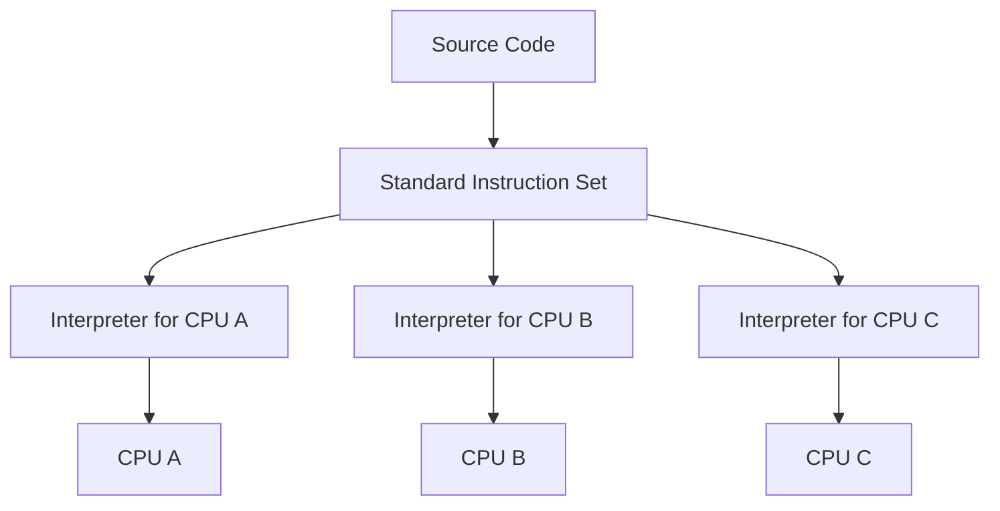
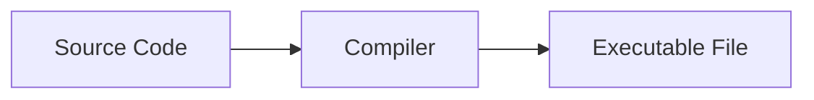
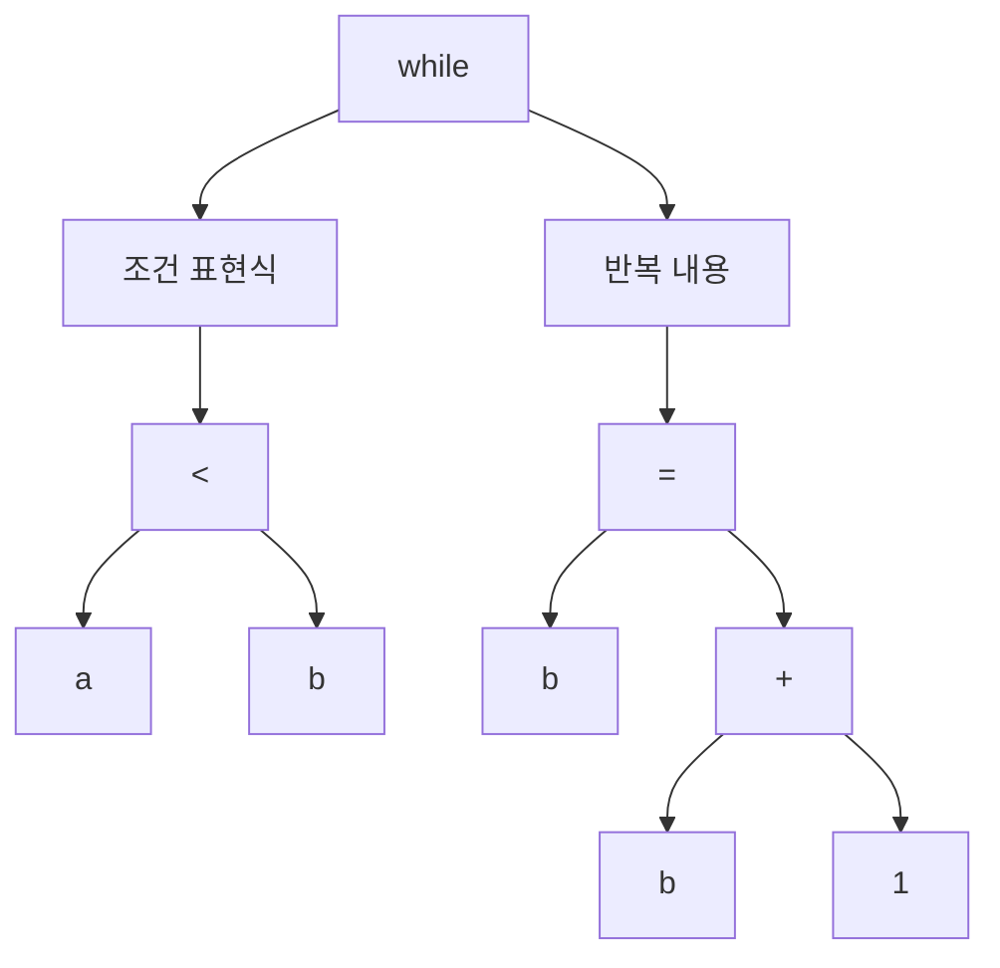
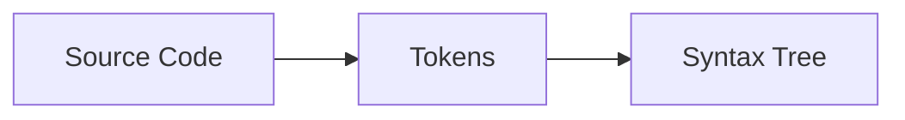
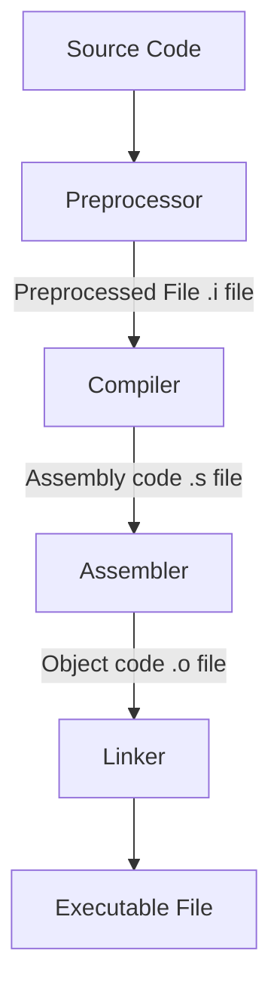
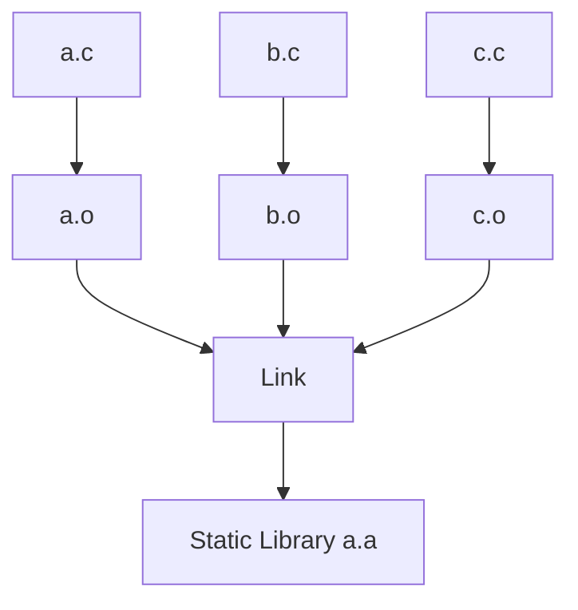
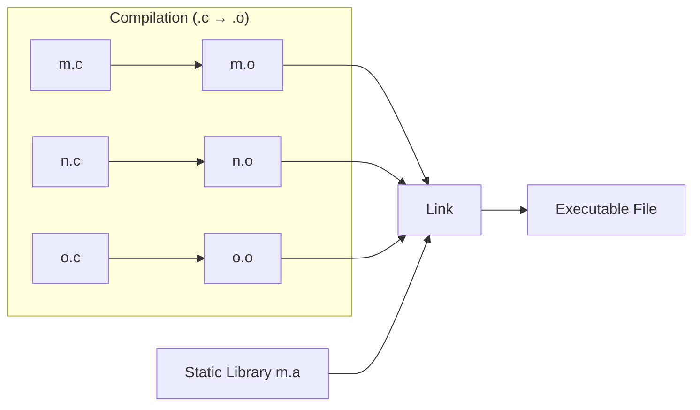
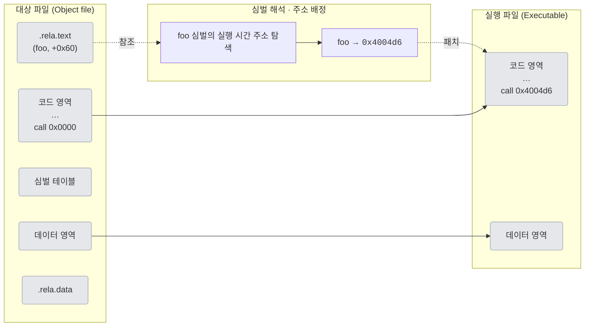
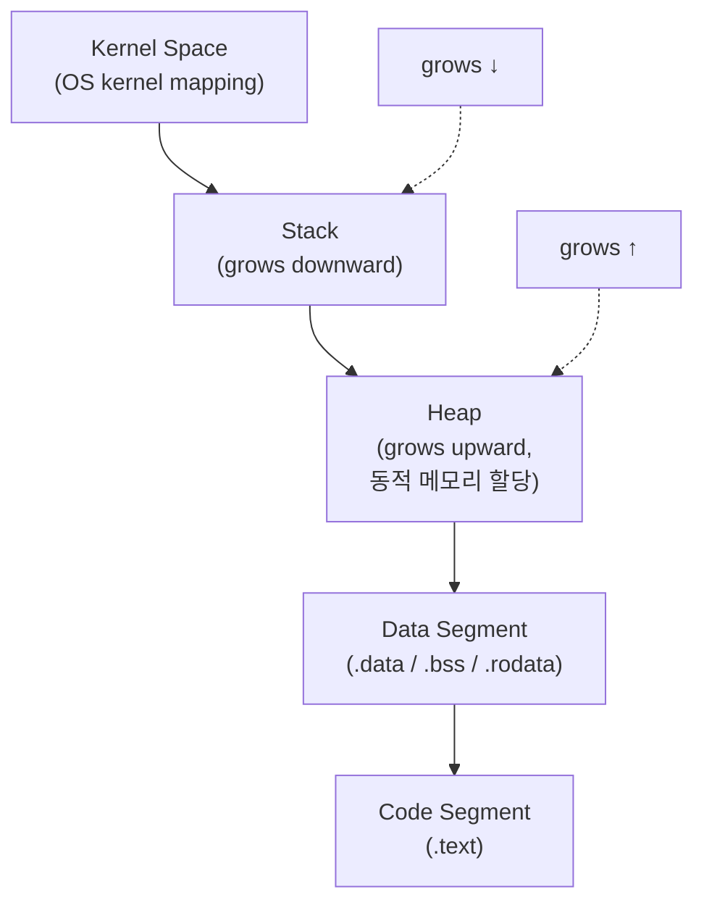

# CHAPTER 1: 프로그래밍 언어부터 프로그램 실행까지, 이렇게 진행된다.

## 1. 여러분이 프로그래밍 언어를 발명한다면?

### 1.1.1 창세기: CPU는 똑똑한 바보
스위치를 조합하면 복잡한 불 논리(boolean logic)를 표현할 수 있다. 이를 기반으로 CPU를 만들었다. 따라서 CPU는 0과 1만 이해한다.
CPU는 데이터를 한곳에서 다른 곳으로 옮기고 간단히 연산한 후 다시 그 데이터를 또 다른 자리로 옮기는 작업을 한다. 이런 작업을 빠른 속도로 처리한다.
> **Note:** CPU는 클럭에 맞춰 동작하며, 클럭 속도는 헤르츠(Hz)로 측정한다.
> 1 GHz는 초당 10^9 **클럭 사이클**을 뜻한다.
> 예컨대 현대 소비자용 CPU는 대략 **기본 2.5–4 GHz, 최대 4–5+ GHz** 수준이며,
> 이는 초당 **수십억 사이클**을 의미한다.

### 1.1.2 어셈블리어 등장
초창기 CPU가 처리한 0과 1은 **기계어**(machine code)다. CPU는 기계어를 이해하고 처리할 수 있다.
하지만 기계어는 사람이 이해하기 어렵기 때문에 **어셈블리어**(assembly language)가 등장했다.
어셈블리어는 기계어와 1:1 대응되는 **저급 언어**(low-level language)로, 사람이 읽고 쓰기 쉬운 형태로 기계어를 표현한다.

### 1.1.3 저수준 계층의 세부 사항 대 고수준 계층의 추상화
어셈블리어는 CPU의 세부 사항을 직접 다루기 때문에 **저수준 언어**(low-level language)라고 한다.
반면, **고수준 언어**(high-level language)는 CPU의 세부 사항을 추상화하였다.
세부 사항을 추상화하여 프로그래머의 생산성을 획기적으로 높였다.

### 1.1.4 가득한 규칙: 고급 프로그래밍 언어의 시작
CPU가 실행하는 명령어는 대부분 단도직입적이고 반복된다. 이런 명령문에는 규칙 또는 패턴이 있는데 이를 추상화 하여 고수준 언어를 만들었다.

> **Note:** 프로그래밍 언어는 크게 세 가지 층으로 이해할 수 있다.
> - **문법(Syntax)**: 토큰과 문장 구조(EBNF 등)를 정의해 소스 코드를 파싱하고 AST(Abstract Syntax Tree)로 변환할 수 있게 한다.
>   - 토큰은 코드에서 가장 작은 단어와 기호를 뜻한다.`(예시: a, =, +, 2, if, (, )).`
>   - 문법(EBNF로 작성되기도 함)은 어떤 토큰 시퀀스가 유효한 문장(문/식)을 만드는지 알려주는 규칙이다.
>   - 구문 분석은 이러한 규칙을 확인하고 코드의 구조를 보여주는 간단한 트리, AST(Abstract Syntax Tree: 추상 구문 트리)라고 한다.
> - **정적 의미(Static semantics)**: 실행 전 검사되는 의미 규칙(타입 일치, 선언/참조 유효성, 접근 제어 등)을 정의한다.
> - **동적 의미(Dynamic semantics)**: 실행 시 문장이 어떻게 평가되고 상태를 어떻게 바꾸는지(연산 순서, 예외, 메모리 효과 등)를 규정한다.
>
> 문법은 형태, 정적 의미는 컴파일 시 의미 규칙, 동적 의미는 실행 시 행동이다.
> ```text
> // 문법 오류 (Syntax error)
> if (x < 0 { y = -x; }           // ')' 누락
> 
> // 정적 의미 오류 (Static semantics)
> "42" - 1                        // 문자열과 숫자 연산: 타입 규칙 위반
> 
> // 동적 의미 오류 (Dynamic semantics)
> 1 / 0                           // 문법·타입은 맞지만 실행 시 예외(ZeroDivision/ArithmeticException)
> 
> ```
> 이런 구분으로 전체 도구(파서/타입체커/컴파일러/런타임) 체인이 각각 명확한 작업을 수행하게하며,
> 개별적이고 안정적인 단계로 작동하게하여 프로그램을 안전하고 효율적으로 빌드, 분석, 최적화 및 실행할 수 있게 한다.

명령어 규칙들은 본질적으로 재귀적이다. 문장은 문장을 포함하고, 식은 식을 포함한다. 그래서 다음 절에서 재귀를 설명한다.

### 1.1.5 <인셉션>과 재귀: 코드 본질
프로그래밍에서 재귀란 함수가 자기 자신을 호출하는 기법이다. 재귀는 반복문을 사용하지 않고도 복잡한 문제를 해결할 수 있게 해준다. 
재귀는 다음과 같은 형태로 표현된다.
- f(x) = f(x - 1) + f(x - 2); // [피보나치의 수](https://leetcode.com/problems/fibonacci-number/description/)
- 참조: [재귀 알고리즘의 예시와 분석](https://run-tom-run.tistory.com/160)

그렇다면, 이런 재귀가 왜 `언어의 본질`과 연결될까? 핵심은 세 가지다.

1. 재귀적 규칙(문법), [참고 강의 링크](https://www.youtube.com/watch?v=F25ez8s3AsQ)  
   프로그래밍 언어의 문법은 스스로를 참조한다. 표현식(Expr)은 항을 더하거나 빼서 만든다. 항(Term)은 인수를 곱하거나 나누어 만든다. 
   인수(Factor)는 숫자 또는 괄호로 묶인 표현식이다. 규칙이 재귀적이기 때문에, 코드의 형태도 자연히 재귀적 구조를 갖는다.
   아래 예시는 Expr 안에 다시 Expr가 등장한다.
   ```text
   Expr  ::= Term | Expr "+" Term | Expr "-" Term
   Term  ::= Factor | Term "*" Factor | Term "/" Factor
   Factor::= Number | "(" Expr ")"
   ```
2. 재귀적 구조(AST)
   파서는 문법에 따라 코드를 트리(AST) 로 만든다. 중첩 if, 괄호식, 블록 안의 블록 등은 모두 자기를 닮은 하위 노드를 갖는다.
   이때 트리를 순회하는 가장 자연스러운 방법이 바로 재귀다.
3. 재귀적 처리(컴파일, 실행)
   컴파일러/인터프리터는 AST를 하향식/상향식으로 재귀 순회하며 타입 검사, 상수 폴딩, 코드 생성 등을 수행한다.
   ```text
   emit(node):
     match node:
       case Num(n):
         out("PUSH", n)
       case Add(l, r):
         emit(l)        # 왼쪽 부분식 코드 생성
         emit(r)        # 오른쪽 부분식 코드 생성
         out("ADD")     # 두 값을 더하는 명령 배치
       case If(cond, t, e):
         emit(cond); out("JZ L_else")
         emit(t);    out("JMP L_end")
         label(L_else); emit(e); label(L_end)
   ```
   위처럼 부분결과를 부모 노드에 적용하며 올라가면, 전체 트리가 구체적인 명령열로 변환된다.

### 1.1.6 컴퓨터가 재귀를 이해하도록 만들기
코드는 텍스트다. 컴퓨터가 이해하려면 먼저 토큰화 → 파싱을 통해 코드를 트리(AST) 로 만든다.
재귀 규칙(예: statements → if bool statements statements | …)은 코드가 **중첩 구조**를 가진다는 뜻이며, 이 구조가 AST로 표현된다.
```text
  statements
 /    \      \
if   bool    statements
             /   \     \
            if  bool   statements
                        /    \    \
                       if   bool  statements 
```

### 1.1.7 우수한 번역가: 컴파일러
컴퓨터는 프로그래밍 언어를 처리할 때 구문 정의에 따라 트리 형태로 코드를 구성한다. 이제 코드는 트리 형태로 표현될 수 있다.
위 재귀에서 마지막 statements가 `mov $1, r1`과 같아진다면, 이는 기계 명령어로도 번역할 수 있다.
결과를 부모 노드에 적용하는 방식으로 트리를 순회하며, 전체 트리를 구체적인 기계 명령어로 번역할 수 있게된다.  
정리해보면, 코드는 텍스트일 뿐이다. 컴파일러는 먼저 텍스트를 코드의 중첩 구조를 반영하는 트리(AST)로 변환한다.
그런 다음 이 트리를 따라 올바른 순서로 저수준 명령어(머신 코드)를 출력한다.

### 1.1.8 해석형 언어의 탄생
시중에는 다양한 CPU가 존재한다. A 형식의 CPU에서 생성된 기계 명령어를 B 형식의 CPU가 이해할 수 없다.
> **Note:** 각 CPU는 고유한 [ISA](https://en.wikipedia.org/wiki/Instruction_set_architecture)(Instruction Set Architecture,
명령어 집합 구조)가 있다. 예를들어 인텔의 x86 또는 x86-64, 애플의 ARM이 있다. ISA가 다르다는건 CPU가 이해할 수 있는 명령어가 다르다는 것이고,
명령어가 달라지면 어셈블리어도 달라진다. 같은 소스코드로 만들어진 프로그램도 ISA가 다르면 CPU가 이해할 수 있는 명령어, 어셈블리어가 달라진다.
이에 따른 영향으로 제어장치가 명령어를 해석하는 방식, 사용되는 레지터의 종류와 개수, 메모리 관리 방법 등 많은것이 달라진다.
ISA는 CPU의 언어이자 하드웨어가 소프트웨어를 어떻게 이해할지에 대한 약속이다.

CPU는 기계 명령어를 실행하는 존재라는 것을 떠올리면, 
직접 **표준 명령어 집합(not a real CPU’s ISA, It is virtual ISA. a.k.a. byte code)** 을 정의해서 CPU의 기계 명령어 실행 과정을 모방하는 프로그램을 작성하여 사용할 수 있다.
따라서 **CPU마다 상응하는 시뮬레이션 프로그램(interpreter/VM/JIT runtime)** 을 준비하면 우리 코드를 직접 서로 다른 OS/CPU 플랫폼에서 실행할 수 있다.
한 번의 코드 작성으로 어디서나 실행할 수 있게 된다.

[//]: # (아래 mermaid가 preview에서 다이어그램으로 표현되지 않는다면 plugin을 설치해야 합니다. marketplace에서 mermaid를 검색하여 설치하세요.)

모든 프로그래밍 언어는 특정 구문에 따라 작성된다. 컴파일러는 언어 구문에 따라 코드 구문을 분석하여 구문 트리로 만들고, 이 구문 트리를 C/C++ 언어처럼 기계 
명령어로 번역하여 CPU로 직접 넘기거나 Java 처럼 바이트 코드(byte code)로 변환한 후 가상 머신으로 넘겨 실행한다.

## 1.2 컴파일러는 어떻게 작동하는 것일까?
컴파일러는 고수준 언어를 저수준 언어로 번역하는 프로그램이다.
> **Note** 컴파일러의 디자인과 구현에 대해 더 자세히 학습하길 원한다면,
> [Andrew Myers의 교육 자료](https://www.cs.cornell.edu/courses/cs4120/2023sp/notes/#visitors)를 참고하자.


컴파일러는 일종의 텍스트 처리 프로그램의 역할을 한다. 이를 위해 아래 과정을 거친다.

### 1.2.2 각각의 토큰 추출하기
컴파일러는 각 항목을 잘게 쪼갠다. 각 항목이 가지고 있는 추가 정보를 함께 묶어서 관리한다. 예를들어 아래와 같은 코드가 있다고 하자.
```text
int a = 1;
int b = 2;
while (a < b) {
    b = b - 1;
}
```

컴파일러는 위와같은 소스코드로 부터 다음과 같은 토큰을 추출한다.  
`int, a, =, 1, ;, int, b, =, 2, ;, while, (, a, <, b, ), {, b, =, b, -, 1, ;, }`  

이는 아래와 같이 추출될 수 있다.
```text
T_Keyword      int
T_Identifier   a
T_Assign       =
T_Int          1
T_Semicolon    ;
T_Keyword      int
... 생략

```
이런 토큰 추출 과정을 **어휘 분석(lexical analysis)** 이라고 한다.

### 1.2.3 토큰이 표현하고자 하는 의미
컴파일러는 구문에 따라 토큰을 처리해야 한다. 예를 들어 다음과 같은 while 문이 있다면,
```text
while (표현식) {
    반복내용
}
```
컴파일러는 while 키워드의 토큰을 찾으면 다음 토큰이 `(` 라는 것을 알고 있는 상태로 기다린다. 하지만 다음 토큰이 while 키워드에 필요한 토큰이 아니라면,
컴파일러는 **문법 오류(syntax error)** 를 발생시킨다. 반면 이 과정을 넘어가면 다음 토큰이 bool 표현식이어야 한다는 것을 알고 기다린다. 
이어서 `)`, `{` 그리고 마지막 `}` 토큰을 찾는다. 이런 과정을 **해석(parsing)** 이라고 한다.
컴파일러가 구문에 따라 해석해 낸 '구조'는 **구문 트리(syntax tree)** 또는 **추상 구문 트리(Abstract Syntax Tree, AST)** 라고 한다.
구문 트리는 코드의 구조를 나타내는 트리 형태의 데이터 구조로, 각 노드는 코드의 구성 요소(예: 변수, 연산자, 함수 호출 등)를 나타낸다.


구문 규칙에 따라 토큰을 해석한 후 생성된 트리가 구문 트리이며, 이 트리를 생성하는 전체 과정을 구문 분석이라 한다.


### 1.2.4 생성된 구문 트리에 이상은 없을까?
구문 트리를 생성한 후, 컴파일러는 이 트리가 올바른지 검사한다. 예를 들어 정수 값에 문자열을 더하면 안되고, 비교 기호의 좌우에 있는 값 형식이 다르면 안된다.
이 단계를 통과하면 컴파일 오류가 없다는 의미이고, 이 과정을 **의미 분석(semantic analysis)** 이라고 한다.

### 1.2.5 구문 트리를 기반으로 중간 코드 생성하기
의미 분석이 끝나면 컴파일러는 구문 트리를 탐색한 결과를 바탕으로 **중간 코드(Intermediate Representation Code, IR Code)** 를 생성한다.
단순한 예시는 아래와 같다.
```text
  a = 1
  b = 2
  goto B
A: b = b - 1
B: if a < b goto A
```


### 1.2.6 코드 생성
이 과정이 완료되면 컴파일러는 앞의 **중간 코드를 어셈블리어 코드로 변환** 한다. x86 어셈블리어 기반의 예는 아래와 같다.
```text
  movl  $0x1, -0x4(%rbp) // a = 1
  movl  $0x2, -0x8(%rbp) // b = 2
  jmp   B                // b로 점프
A: subl $0x1, -0x8(%rbp) // b = b - 1
B: mov  -0x4(%rbp), %eax // a를 eax로 이동
   cmp  -0x8(%rbp), %eax // a < b ?
   jl   A                // a < b 이면 A로 점프
```
마지막으로 컴파일러는 이 어셈블리어 코드를 기계어로 변환한다.

GCC 컴파일러의 경우, 이 과정을 다음과 같이 나누어 처리한다.

모든 소스 파일에는 각각의 Object File이 생성된다. 만약 소스 파일이 여러 개라면, Object File도 여러 개가 생성되는것이다. 하지만 원하는 것은 하나의 실행 파일이다.
따라서 이 여러 개의 Object File을 하나로 묶어주는 작업이 필요하다. 이런 작업은 **링커(linker)** 가 담당한다.

## 1.3 링커의 말할 수 없는 비밀
일반적으로 외부 코드는 정적 라이브러리(static library) 또는 동적 라이브러리(dynamic library)로 제공된다.
링커는 컴파일러가 생성한 Object File을 하나로 묶어 실행 파일을 생성하는 역할을 한다.

### 1.3.1 링커는 이렇게 일한다
링커(linker)는 컴파일·어셈블 과정에서 생성된 여러 오브젝트 파일과 라이브러리를
하나의 실행 파일(또는 공유 라이브러리)로 **결합** 하는 도구다. 이때 링커는
**심벌 해석(symbol resolution)** 과 **재배치(relocation)**, 섹션 배치/주소 할당 등을 수행해
모든 참조가 올바른 실제 주소를 가리키도록 만든다.

링크 방식은 크게 두 가지다.
1. **정적 링크(빌드/링크 타임)**  
   빌드 시 필요한 오브젝트/정적 라이브러리(.a)를 실행 파일에 **포함**한다.
    - 심벌 해석: 참조된 심벌을 유일한 정의로 연결
    - 재배치: 최종 배치 주소에 맞춰 코드/데이터의 참조를 조정

2. **동적 링크(로드 타임, 필요 시 런타임 지연 바인딩)**  
   실행 파일에는 필요한 공유 라이브러리(.so/.dylib/.dll) **이름/버전 정보**만 기록한다.
   프로그램 시작 시 **동적 로더** 가 라이브러리를 매핑하고 재배치/바인딩을 수행하며,
   일부 호출은 **지연 바인딩(lazy binding)** 으로 처음 호출 시 해소될 수 있다.

### 1.3.2 심벌 해석: 수요와 공급
심벌은 프로그램에서 사용되는 변수, 함수, 클래스 등의 이름을 의미한다. 지역 변수는 모듈 내에서만 사용되어 외부 모듈에서 참조할 수 없기 때문에 링커의 관심 대상이 아니다.
링커는 모든 외부 심벌마다 대상 정의가 하나만 존재하는지 확인한다. 링커가 참조해야할 심벌은 컴파일러가 알려준다. 컴파일러는 기계 명령어를 생성할 뿐만 아니라 
이 명령어를 실행시키는 데이터도 생성한다. 이 데이터는 Ojbect File에 반드시 포함돼야 한다. 따라서 Object File 에는 **명령어 부분**과 **데이터 부분**이 포함된다.
- 명령어 부분: 소스 파일에 정의된 함수에서 변환된 기계 명령어가 저장되는 부분, **코드 영역(Code Section)** 이라고 한다.
- 데이터 부분: 소스 파일의 전역 변수가 저장되는 부분이다. **데이터 영역** 이라고 한다. 참고로 로컬 변수는 프로그램이 실행된 후 스택 영역에서 
  생성되고 사용하면 제거되기 때문에 Object File에 포함되지 않는다.

참조된 변수 정의를 찾는 일은 컴파일러가 아닌 링커 몫이다. 컴파일러는 소스 파일마다 외부에서 참조 가능한 심벌이 어떤 것인지 그 정보를 기록하고,
반대로 어떤 외부 심벌을 참조하고 있는지도 기록한다. 이를 **심벌 테이블(symbol table)** 이라고 한다. 심벌 테이블은 공급과 수요라는 두가지 내용만 표현한다.
- 내가 정의한 심벌, 즉 다른 모듈에서 사용할 수 있는 심벌
- 내가 사용하는 외부 심벌

이로써 Object File은 코드영역, 데이터 영역, 심벌 테이블을 포함하게 된다. 심벌 해석은 각 대상 파일에서 사용할 외부 심벌이 심벌 테이블에서 정의된 심벌과
일치하는지 확인하는 과정이다.

### 1.3.3 정적 라이브러리, 동적 라이브러리, 실행 파일
코드를 별도로 컴파일한 후 패키지로 묶고, 구현된 모든 함수의 선언을 포함하는 헤더 파일(header file)을 제공하는 것을 정적 라이브러리(static library)라고 한다.
윈도우에서는 `.lib` 확장자를 사용하고, 리눅스/유닉스에서는 `.a` 확장자를 사용한다. 정적 라이브러리 기능을 사용하면 소스 파일 여러 개를 파일마다 단독적으로 
미리 컴파일 하고 링크하여 정적 라이브러리로 생성할 수 있다. 

이후 실행 파일을 생성할 때는 자신의 코드만 컴파일 하며, 미리 컴파일이 완료된 정적 라이브러리는 다시 컴파일할 필요 없이 과정에서 실행 파일에 복제된다.
코드가 의존하는 외부 코드를 매번 컴파일 하지 않아도 되기 때문에 컴파일 속도가 빨라진다.


정적 링크는 각 Object File을 한데 모아 파일들의 데이터 영역과 코드 영역을 결합하는 것이다.
실행파일에는 특수한 심벌인 _start 심벌이 포함된다. CPU는 이 심벌 주소에서 프로그램을 실행하는 데 필요한 기계 명령어를 찾는다.
기계 명령어를 실행한 후에 우리가 작성한 main 함수를 실행한다.

정적 링크는 라이브러리를 실행 파일에 직접 복사하기 때문에 실행 파일은 모두 동일한 코드와 데이터의 복사본을 갖게된다.
이로인해 디스크와 메모리를 낭비할 수 있다. 정적 라이브러리의 크기가 2MB고 이를 실행하는 파일이 500개라면, 1GB 크기의 데이터가 중복된다.
또한 정적 라이브러리의 내용에 종속성이 있다고 가정하면, 이 라이브러리의 코드가 변경 될때마다 종속된 프로그램 역시 다시 컴파일 해야 한다.
이를 해결하기 위해 동적 라이브러리(dynamic library)가 등장했다. 리눅스의 동적 라이브러리는 `.so` 확장자를 사용하며, 접두사로 `lib`를 사용한다.
```shell
$ gcc -shared -fPIC -o libmylib.so a.c b.c
```
위 명령어는 `a.c, b.c` 파일을 컴파일하여 `libmylib.so` 라는 동적 라이브러리를 생성한다.
동적 라이브러리 또한 코드 영역, 데이터 영역 등이 포함되어 있다. 그리고 이름, 심벌 테이블, 재배치 정보 등 필수 정보만 실행 파일에 포함된다.
따라서 정적 라이브러리에 비해 실행 파일의 크기를 확실히 줄일 수 있다.
참조된 동적 라이브러리의 필수 정보는 실행 파일 내에 저장된다. 따라서, 실행 파일이 포함하는 내용은 `코드 영역, 데이터 역영, 동적 링크 관련 정보`이다.
이 필수 정보는 동적 링크(dynamic linking)가 실행될 때 사용된다. 동적 라이브러리에 의존하는 실행 파일은 컴파일 단계에서 필요 정보만 저장하기에 
링크는 실제 프로그램의 실행 시점까지 지연된다. 

동적 링크에는 두 가지 방식이 있다.
1. 프로그램이 메모리에 적재될 때 동적 링크가 진행된다. 실행 파일을 메모리에 적재하고 나면 적재 도구(loader)는 실행 파일이 동적 라이브러리에 의존하는지 
   여부를 확인할 수 있다. 만약 의존한다면, 동적 링커(dynamic linker)라는 별도의 프로세스가 실행되어 참조하는 동적 라이브러리의 존재 여부와 위치, 
   심벌의 메모리 위치 등을 확인하여 링크 과정을 마무리한다. 이 과정이 완료된 후 프로그램이 시작된다. 
2. 프로그램이 먼저 실행된 후, 프로그램의 실행 시간(runtime) 동안 코드가 직접 동적 링크를 실행할 수 있다. 실행 시간이란 CPU가 프로그램을 시작한 시점부터 
   완료되어 종료된 시점까지의 시간이다. 실행 시간 동적 링크(runtime dynamic linking)는 실행 과정을 프로그램이 실행된 이후로 미룬다. 
   이 방식에서는 실행 파일이 생성되는 과정 중, 그 내부에 동적라이브러리 정보를 저장하지 않는다.

### 1.3.4 동적 라이브러리의 장단점
리눅스 시스템은 C 표준 라이브러리를 비롯한 여러 **동적 라이브러리(공유 라이브러리)** 에 의존한다. 정적 링크로 각 실행 파일에 라이브러리 코드를 포함하면 
디스크와 메모리에 **중복**이 많아진다. 반면 동적 링크를 사용하면 디스크에는 `.so` 파일 **하나**만 존재하고, 실행 시 동적 로더가 이를 매핑하므로 
여러 프로세스가 **코드(.text)와 기타 읽기 전용 페이지를 공유**해 **메모리 사용을 절감**할 수 있다. 
또한 라이브러리를 **ABI(Application Binary Interface) 호환** 범위에서 교체하면, 개별 실행 파일을 다시 빌드하지 않고도 보안 패치나 버그 수정을 
적용할 수 있어 **재사용성과 유지보수성**이 높다.

**장점**
- 디스크/메모리 절감: 코드 페이지 공유(읽기 전용).
- 패치 용이: ABI 호환 시 라이브러리 교체만으로 다수 프로그램에 수정 적용.
- 배포 크기 감소: 실행 파일이 작아짐.

**단점 및 주의점**
- **ABI 호환성** 요구: 함수 시그니처, 구조체 레이아웃, 심벌 버전이 바뀌면 앱이 깨질 수 있음.
- 시작/호출 오버헤드: 로드 타임 재배치, 심벌 결합, 지연 바인딩 비용.
- **의존성 관리** 복잡성: 버전 충돌, 경로 문제(예: `LD_LIBRARY_PATH`) 등.

> 참고: 플러그인 아키텍처는 보통 **동적 라이브러리 + 런타임 로딩**(`dlopen`/`dlsym` on POSIX, `LoadLibrary` on Windows)으로 구현한다.  
> 이때도 **안정된 플러그인 ABI**(인터페이스) 설계가 핵심이다.

### 1.3.5 재배치: 심벌의 실행 시 주소 결정하기
변수나 함수에는 메모리 주소가 있다. 어셈블리어로 작성된 코드를 살펴보면, 명령어에 변수 정보 대신 메모리 주소를 사용하는것을 볼 수 있다.
어떤 코드가 foo 함수를 호출하려 할 때, 그에 대응하는 기계 명령어는 다음과 같다.
```text
  call 0x4004d6
```
컴파일을 통해 Object File을 생성할 때 foo 함수가 어느 메모리 주소를 넣어야 할지 알 수 없다. 따라서 이 시점에는 간단하게 0x00으로 지정하여 호출한다는 사실만 기록한다.
컴파일러는 메모리 주소를 확정할 수 없는 변수를 발견할 때마다 Object File에 `.relo.text` 에 해당 명령어를 저장하고 `.relo.data`에는 명령어와 관련된 데이터를 저장한다.
예를 들어 foo 함수의 경우, 컴파일러는 call 명령어를 생성하면서 '코드 영역의 시작 주소 기준 오프셋이 60바이트인 위치에서 foo 심벌을 발견했지만, 실행 시에 
어떤 주소에서 실행해야 할지 알수 없음. 링커는 실행 파일을 생성할 때 이 명령어를 수정해야 함.' 이라고 기록한다.

링커는 **심벌 해석(symbol resolution)** 을 완료해야만 링크 과정에 오류가 없다고 확신할 수 있다.
Object File 의 각 유형별 영역이 결합되면 기계 명령어와 전역 변수가 프로그램 실행 시간에 위치할 메모리 주소를 결정할 수 있다.  
링커는 각 Object File의 .relo.text 영역(segment)을 하나씩 읽어 기계 명령어를 수정해야 하는 foo 라는 심벌이 있으며, 
이 심벌의 코드 영역 시작 주소 기준 오프셋이 60바이트인 것을 확인한다. 링커는 확인한 정보를 이용하여 실행 파일에서 해당 call 명령어를 찾고,
이동할 소스 주소를 0x00에서 0x4004d6으로 변경한다. 이와 같은 심벌의 메모리 주소를 수정하는 과정을 재배치(relocation)라고 한다.




### 1.3.6 가상 메모리와 프로그램 메모리 구조
변수나 명령어의 메모리 주소는 프로그램이 실행될 때마다 변경되기 때문에 실제로 그 시점이 되어야 정확한 주소를 알 수 있다.
이런 문제를 해결하기 위해 **가상 메모리(Virtual Memory)** 라는 개념이 등장했다.
가상 메모리는 프로그램이 사용하는 메모리 주소 공간을 추상화하여, 각 프로그램이 독립적인 주소 공간을 갖도록 하는 기술이다.
링커는 실행 시간 메모리 주소를 결정할 때, 가상 메모리 주소를 사용한다.


프로그램이 실행되면 프로세스(process)가 메모리에 적재된다. 프로세스는 커널이 관리하는 메모리 공간으로, 각 프로세스는 독립적인 가상 메모리 주소 공간을 갖는다.
프로세스의 메모리 구조는 다음과 같다.
- **커널 영역**(Kernel Space): OS 특권 메모리, 사용자 코드가 직접 접근 불가(매핑 방식은 OS/아키텍처마다 상이).
- **스택(Stack, 스레드별)**: 호출 프레임, 반환 주소, 저장 레지스터; 레지스터에 없을 때 매개변수/지역변수 저장.
- **힙 영역(Heap Segment)**: 동적 할당 영역; 메모리 할당기가 관리하며 개념상 위로 증가.
- **데이터 영역(Data Segment)**: 전역·정적 변수(초기화됨, 제로 초기화, 읽기 전용)
- **코드 영역(Code Segment)**: 읽기 전용 실행 명령어 구역.

위 구조는 프로세스가 어떤 형태로 메모리에 적재되는지를 보여준다. (참고로 malloc 함수는 힙 영역에서 메모리를 할당받는다.)
데이터 영영과 코드 영역은 실행 파일의 내용이 메모리에 적재되는 곳이다. 이런 구조는 실제 물리적인 메모리가 아닌 논리적으로 구성된 
가상의 메모리이다. 

64비트 시스템을 예로 들면 코드 영역은 가상 메모리의 주소 0x400000에서 시작하고, 스택 영역은 항상 메모리의 상단 주소에 위치한다.
**가상 메모리** 구조를 사용하면 메모리 주소가 가상이라고 하더라도 **실행 시 심벌의 메모리 주소를 확인**할 수 있다.

## 1.4 컴퓨터 과학에서 추상화가 중요한 이유
### 1.4.1 프로그래밍과 추상화
프로그래머는 추상화를 통해 복잡한 시스템을 단순화하고, 코드의 재사용성을 높이며, 유지보수를 용이하게 한다.
객체 지향 언어에서 추상화는 인터페이스/추상 타입, 다형성(제네릭), 캡슐화, 그리고 상황에 따라 상속과 구성(Composition) 으로 표현된다.
프로그래머는 구체적인 내부 구현이 아닌 추상화만 고려하여 프로그램 확장성이 향상되고 요구 사항 변화에도 더 잘 대응할 수 있게된다.

### 1.4.2 시스템 설계와 추상화
컴퓨터 시스템은 층층이 쌓인 **추상화** 위에 구축된다.
- **하드웨어 추상화**: OS는 디바이스 드라이버/펌웨어/HAL을 통해 CPU·메모리·I/O 장치의 차이를 숨기고,
  사용자 공간에는 시스템 콜과 파일 디스크립터(디바이스 파일 포함) 같은 **일관된 인터페이스**를 제공한다.
- **운영 체제 추상화**: 프로세스(독립 가상 주소 공간), 스레드(스케줄링 단위), 파일/소켓/파이프(파일 디스크립터),
  IPC, 권한/보안 모델 등을 제공해 하드웨어 세부사항 없이 프로그램을 작성·실행할 수 있게 한다.
- **네트워크 추상화**: TCP/IP 계층 위에 **소켓 API**를 제공해 동일한 코드로 다양한 네트워크에서 통신하게 한다.
- **프로그래밍 언어 추상화**: 고수준 언어는 타입/모듈/예외/메모리 관리 및 표준 라이브러리(STL 등)를 통해
  저수준 세부를 감추고, 더 안전하고 생산적인 코딩을 가능하게 한다.

> 주의: 추상화는 때로 **새는(Leaky)** 특성이 있어 성능, 파일시스템 동작, 네트워크 MTU, 메모리 모델 등의 하부 특성이 문제 해결에 영향을 줄 수 있다.

---

# UHD 님의 특강

컴퓨터라는 기계의 구조를 단순히 암기하며 학습하는게 아닌 CS 개념(concept)을 이해해야 한다.
- 컴퓨터 설계/제작과 Operating System 개발 과정에서 겪었던 이슈(시그널)가 있다.  
  이를 해결하는 과정 그리고 그 솔루션을 통해 개념을 이해할수 있다.


```text
  이슈(시그널) -> 경력/경험 -> 능력
  이슈(시그널) -> 해결 -> 컴퓨터 환경/프로그래밍
  Why, How, Where, What => Insight
```

기본 프로그래밍 원칙
- 데이터의 명확성
- 추상화
    - 재사용성
        - 반복: 기계를 사용해야 하는 이유
