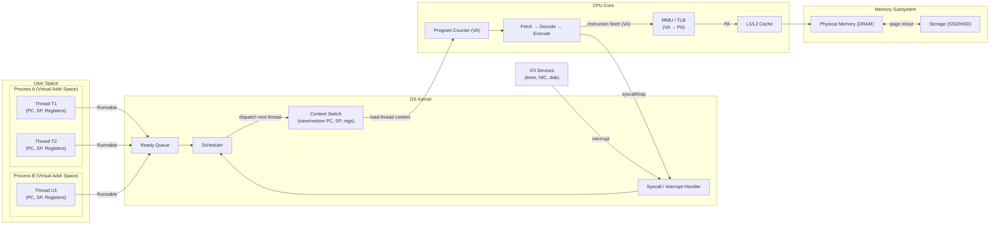
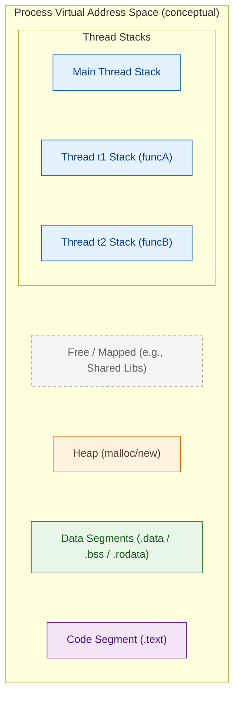
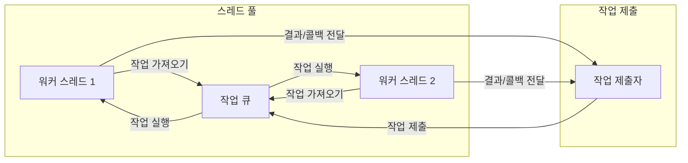

# CHAPTER 2: 프로그램이 실행되었지만, 뭐가 뭔지 하나도 모르겠다

Chapter 1을 통해 사람이 이해할 수 있는 문자열 Source Code가 CPU를 위한 기계 명령어로 변환되는 과정을 살펴보았다.  
이번 장에서는 프로그램이 실행되었을 때, 운영 체제와 프로세스, 스레드가 어떻게 작동하는지에 대해 알아본다.

### 1. 운영 체제, 프로세스, 스레드의 근본 이해하기
CPU 입장에서 생각해보면 '스레드', '프로세스', '운영 체제' 란 개념을 알 수 없다.  
CPU는 단순히 명령어를 실행하는 장치일 뿐이다. CPU는 메모리에서 명령어를 읽고, 그 명령어에 따라 연산을 수행한다.  
CPU가 명령어를 가져와 실행하는 과정은 다음과 같다.
1. 명령어 인출
2. 명령어 실행
3. 다음 명령어 인출

위와 같은 **명령어 사이클(Instruction Cycle)** 은 CPU가 **프로그램 카운터(Program Counter, PC)** 에 있는 **가상 주소**를 기준으로 명령어를
가져오고(Fetch), 해독하고(Decode), 실행하는 하드웨어 동작을 말한다. 운영 체제(OS)는 개별 명령어 실행을 직접 관리하지 않는다.
대신 어떤 스레드가 언제 CPU를 쓸지(Scheduling) 결정하고, 가상 메모리를 구성하며, 시스템 콜/인터럽트/예외를 처리한다.
CPU가 "다음 명령어"를 가져오는 기준은 PC 다. PC에는 가상 주소가 들어 있으며, MMU/TLB 가 이를 물리 주소로 변환해 I-캐시/메모리에서 명령어를 가져온다.
새 프로그램을 시작할 때는, OS가 실행 파일을 메모리에 매핑하고 레지스터를 초기화한다.
PC는 실행 파일의 엔트리 포인트로 설정되며, 스택 포인터도 초기화된다.

**프로세스** 는 실행 중인 프로그램의 인스턴스이며 고유한 가상 주소 공간을 갖는다.
구조체(structure)로 표현되며, 프로세스의 상태(실행 중, 대기 중 등), 메모리 맵, 파일 디스크립터 등을 포함한다.  
**스레드** 는 프로세스 내 실행 흐름으로, 같은 주소 공간(코드/데이터/힙/파일 디스크립터 등)을 공유한다.
여담으로 스레드를 독립된 개체가 아닌, **자원 공유 수준을 사용자가 정의할 수 있는 실행 컨텍스트(Context of Execution, COE)** 로 생각할 수 있다.

아래는 프로그램이 실행될 때의 개념적 구조를 나타낸 다이어그램이다.

프로그램에는 반드시 시작 지점이 있다. 우리가 흔히 main을 시작으로 생각하지만, 실제 실행 흐름은 조금 더 이르다.
운영 체제는 실행 파일을 메모리에 매핑하고, 초기 레지스터와 스택을 준비한 뒤 엔트리 포인트(예: _start)로 점프한다.
런타임이 인자(argc/argv/envp)를 설정한 다음에야 main을 호출하고, main이 끝나면 종료 루틴을 통해 프로그램이 정리된다.

만약 OS 없이 이 과정을 처리한다면, 프로그램을 올릴 메모리 영역을 직접 확보하고, 레지스터/스택 초기화, 진입 주소 결정, 디스크에서 코드 적재 같은 모든 작업을 스스로 구현해야 한다.
현대 운영 체제는 이 수고를 대신하고, 더 나아가 프로세스와 스레드를 만들고 스케줄링하며, 가상 메모리와 시스템 콜로 실행 환경을 제공한다.

그렇다면 싱글 코어 CPU에서 OS는 어떻게 여러 작업과 사용자 프로그램을 "동시에" 실행하는것 처럼 보일까?

### 동시성과 병렬성
그 방법은 **동시성(Concurrency)** 처리다. 나아가 멀티 코어 CPU에서는 **병렬성(Parallelism)** 을 활용한다.  
현대 운영체제는 동시성 프로그램을 만들기 위해 세 개의 기본 접근방법을 제공한다.
- 프로세스. 이 방법에서, 각 논리적 흐름은 OS 커널이 스케줄하고 관리하는 프로세스다. 프로세스가 별도의 가상 주소공간을 가지기 때문에, 서로 통신하기를 원하는
  흐름들은 모종의 명시적 프로세스 간 통신(Interprocess Communication, IPC) 메커니즘을 사용해야 한다.
- I/O 다중화. 이것은 동시성 프로그래밍의 한 형태로, 응용들은 명시적으로 자신의 논리흐름을 한 개의 프로세스 컨텍스트 내에서 스케줄한다.
  논리적 흐름들은 파일 식별자에 도착하는 데이터로 인해 메인 프로그램이 명시적으로 하나의 상태에서 다른 상태로 전환하는 상태 머신으로 모델할 수 있다.
  프로그램이 한 개의 프로세스이므로 모든 흐름들은 동일한 주소공간을 공유한다.
- 스레드. 쓰레드는 한 개의 프로세스 컨텍스트에서 돌아가는 논리적 흐름으로 커널에 의해서 스케줄된다.
  스레드를 다른 두 개의 방식의 하이브리드 형태로 생각할 수 있으며, 프로세스 흐름처럼 커널에 의해서 스케줄되며 I/O 다중화 흐름처럼 동일한 가상 주소공간을 공유한다.

동시성은 한 코어에서 짧은 시간 단위로 작업을 **교대로 실행(Context Switching)** 하여, 여러 일이 "함께 진행되는 것처럼" 보이게 하는 방법이다.  
예를 들어 A, B, C 세 작업이 차례로 아주 빠르게 번갈아 실행되면, 사용자 눈에는 동시에 돌아가는 것처럼 느껴진다.

**병렬성(Parallelism)** 은 여러 코어(혹은 여러 CPU)에서 정말로 동시에 서로 다른 작업을 실행하는 것이다.  
동시성을 활용해 시스템을 더 빠르게 만들 수도 있지만, 실제 속도 향상은 병렬성이 있을 때 더 분명해진다.
- 멀티 코어 시스템에서는 여러 코어가 서로 다른 스레드를 동시에 실행한다. 스케줄러는 레디 큐의 스레드를 각 코어에 배치하고, 실제 병렬 실행은 코어가 수행한다.
  이로써 CPU 자원을 효율적으로 활용할 수 있다.
- 멀티 프로세스와 IPC  
  프로세스는 서로 다른 가상 주소 공간을 가지므로 기본적으로 메모리를 공유하지 않는다.
  데이터를 주고받으려면 프로세스 간 통신(IPC)—파이프, 소켓, 메시지 큐, 또는 공유 메모리(+동기화)—가 필요하다. 이 때문에 프로그래밍 복잡도가 높아지며,
  생성·전환 비용도 스레드에 비해 대체로 더 크다.
- 스레드(프로세스 → 스레드로의 진화)  
  이런 한계를 완화하기 위해 같은 프로세스 안에서 메모리를 공유하며 동시에 실행되는 여러 흐름을 두는 스레드가 도입되었다.
  스레드는 코드/데이터/힙을 공유하므로 협업이 빠르고, 생성과 전환 비용도 프로세스보다 작다.
  중요한 점은, 같은 상태를 공유하면서 동시에 실행하는 것이다. 싱글 코어에서는 스케줄러가 스레드들을 교대로 실행해 동시성을 제공하고,
  멀티 코어에서는 여러 스레드가 진짜 동시에 실행되어 병렬성이 실현된다.
    - CPU가 여러개인 상태에서는 공유 프로세스 주소 공간에서 동일한 프로세스에 속한 명령어를 동시에 실행할 수 있다.
      다시 말해 하나의 프로세스 안에 여러 실행 흐름이 존재할 수 있다. (예제 코드를 보면 이해하기 훨씬 편하다.)
      ```text
      int x = 0;
      int y = 0;
      
      void funcA() {
          resA = 1;
      }
      
      void funcB() {
          resB = 2;
      }
      
      int main() {
        thread t1(funcA);
        thread t2(funcB); 
        // join은 스레드가 끝날 때까지 기다리는 함수  
        t1.join(); 
        t2.join(); 
        print(resA + resB); // 3
      }
      ```
      각 함수를 스레드로 실행하면, funcA와 funcB가 동시에 실행될 수 있다. 이때, resA와 resB는 각각 스레드가 공유하는 메모리 공간에 저장된다.
      스레드 t1이 funcA를 실행하면서 resA에 1을 저장하고, t2가 funcB를 실행하면서 resB에 2를 저장한다.
      이후 t1과 t2가 join을 통해 종료될 때까지 기다린다. 마지막으로, main 함수에서 resA와 resB를 더해 3을 출력한다.
      이 예제는 스레드가 어떻게 동시에 실행되면서도 공유 메모리 공간을 통해 협력하는지를 보여준다. 스레드라는 개념을 이용해, 프로세스를 시작하고 스레드 여러 개를 생성하면 다중 코어를 충분히 활용할 수 있다.
      이것이 높은 동시성을 제공하는 프로그래밍의 기본이다.
    - 각 스레드가 프로세스의 메모리 주소 공간을 공유하기 때문에 IPC와 같은 복잡한 통신 메커니즘이 필요 없다.
      이것은 프로그래머에게 큰 편의성을 제공하지만, 많은 문제를 일으키기도 한다. 다중 스레드가 공유 리소스에 접근할 때 오류가 발생하는 것은
      CPU가 명령어를 실행할 때 스레드를 전혀 고려하지 않기 때문이다. 따라서 프로그래머는 상호 배제(Mutual Exclusion)와 동기화(Synchronization)를
      통해 다중 스레드 공유 문제를 명시적으로 직접 해결해야 한다.

요약하면, 운영 체제는 누가 CPU를 언제 쓸지를 정하고(스케줄링), CPU는 프로그램 카운터(PC) 가 가리키는 주소에서 명령어를 가져와 실행한다(명령어 사이클).
이때 싱글 코어에서는 동시성으로, 멀티 코어에서는 동시성과 병렬성을 함께 사용해 사용자에게 빠르고 매끄러운 실행 경험을 제공한다.

### 스레드와 메모리 구조
함수가 실행될 때 필요한 정보는 함수의 매개변수, 지역 변수, 반환 주소 등이 있다. 이런 정보는 **스택 프레임(stack frame)** 에 저장되며,
모든 함수는 실행 시에 자신만의 실행 시간 스택 프레임(runtime stack frame)을 갖는다. 함수가 실행될 때, 스택 프레임은 스택에 쌓이고,
함수가 끝나면 스택에서 제거된다. 이런 스텍 프레임의 증감이 프로세스 주소 공간에서 스택 영역을 형성한다.

스레드는 실행 컨텍스트의 자원 공유 수준을 사용자가 정의할 수 있는 수준으로 다루어 동시성을 제공한다.
프로세스는 실행 시 정보를 저장하는 스택영역이 하나만 있으면 됐다.
실행 흐름 여러 개를 가지는 프로세스는 스택 영역을 여러 개 가지게 된다.(스레드를 여러개 실행하는 프로세스는 스택 영역을 여러 개 가지게 된다.)
또 프로세스의 주소 공간에 각 스레드를 위한 스택영역이 별도로 있어야 한다.


스레드가 처리해야 하는 작업은 긴 작업과 짧은 작업으로 나눌 수 있다.
- 작업 예시:
    - 긴작업: Word 문서 편집 후 디스크에 저장. 이런 디스크 기록 스레드의 수명 주기와 Word 기반 프로세스의 수명 주기는 같음.
    - 짧은 작업: 키 입력 처리/커서 이동, 현재 문장만 맞춤법 체킹, 작은 증분(auto-save delta) 기록 등등
- 이에 따라 생기는 문제
    - 스레드 생성과 종료에 많은 시간을 허비
    - 독립적인 스택 영역을 계속해서 생성하다 보면 리소스 낭비가 심함
    - 짧은 작업이 많아지면 스레드가 자주 생성되고 종료되어 CPU 캐시가 자주 비워짐
- 이를 해결하기 위해 스레드 풀이 생김

스레드 작업 제출과 워커 스레드 실행. 대기열을 사용하고 생산자-소비자 패턴을 따른다.

- 호출자가 작업을 큐에 넣음.
- 풀의 워커가 큐에서 작업을 꺼내 수행. 완료 후 결과/콜백을 게시.

## 2. 스레드 간 공유되는 프로세스 리소스
### 개별 스레드 전용 리소스는 무엇이 있을까?
- 스레드 ID: 각 스레드는 고유한 식별자를 가진다.
- 스택: 각 스레드는 독립적인 스택을 가지며, 함수 호출 시 지역 변수와 반환 주소를 저장한다.
- 프로그램 카운터(PC): 각 스레드는 자신의 프로그램 카운터를 가지며, 현재 실행 중인 명령어의 주소를 가리킨다.
- 스택 포인터(SP): 현재 스레드의 스택 위치를 가리키는 포인터로, 함수 호출 시 스택 프레임을 관리한다.
  이런 정보를 통틀어 스레드 상황정보(Thread Context)라고 한다. 전용 리소스를 제외한 나머지는 스레드 간의 공유되는 리소스에 해당한다.

### 스레드가 공유하는 프로세스 리소스는 무엇이 있을까?
스레드는 프로세스의 주소 공간을 공유한다. 즉, 스택을 제외한 코드, 데이터, 힙 영역을 모두 공유한다.
코드 영역에는 프로그래머가 작성한 코드가 컴파일 된 후 생성된 '실행 가능한 기계 명령어'가 저장된다.
- 코드 영역: 스레드 간에 공유되므로 어떤 함수든지 모든 스레드에 적재하여 실행할 수 있다. 단, 코드 영역은 읽기 전용이므로 스레드가 코드를 수정할 수는 없다.
- 데이터 영역: 전역 변수가 저장되는 곳이다. 프로그램이 실행되는 동안 데이터 영역 내에 전역 변수의 인스턴스(instance)가 하나만 존재하며,
  모든 스레드는 이 전역 변수에 접근할 수 있다. 즉, 어떤 스레드가 이 전역 변수 값을 변경하면 이후 다른 스레드도 변경된 값을 읽게 된다.
- 힙 영역: C/C++에서 동적 메모리 할당을 위해 사용되는 영역이다. malloc 이나 new 연산자를 통해 할당된 메모리는 힙 영역에 저장된다.
  모든 스레드는 포인터(pointer)를 통해 포인터가 가리키는 데이터에 접근할 수 있다.
- 스택영역: 서로 다른 프로세스의 주소 공간은 서로 격리되어 있으며, 가상 메모리 시스템은 특별한 경우를 제외하고 다른 프로세스의 주소 공간에 속한 데이터에 직접
  접근하지 못하도록 보장한다. 하지만, 서로 다른 스레드의 스택 영역 간에는 이런 보호가 없다. 따라서 스레드가 다른 스택 프레임에서 포인터를 가져올 수 있다면
  해당 스레드는 다른 스레드의 스택 영역을 직접 읽고 쓸 수 있다. (수많은 문제를 일으킬 가능성이 높다.)

### 동적 링크 라이브러리와 파일
동적 링크에는 실행 파일에 종속된 라이브러리의 코드와 데이터가 포함되어 있지 않기 때문에 프로그램을 시작할 때 또는 실행 중일 때 종속된 라이브러리의
코드와 데이터를 찾아서 프로세스 주소 공간에 넣는 링크 과정이 완료되어야 한다. 이 데이터와 코드는 프로세스 주소 공간에서 여유공에 적재된다.
즉, 프로세스 내 모든 스레드가 동적 링크 라이브러리의 코드와 데이터를 공유한다.

### 스레드 전용 저장소
이 영역에 저장된 변수는 모든 스레드에서 접근할 수 있지만, 각 스레드가 독립적으로 값을 유지한다.  
아래는 c++에서 thread_local 키워드 사용하여 스레드 전용 저장소를 선언하는 예시 코드다.  
[online compiler](https://www.onlinegdb.com/online_c++_compiler)에서 실행해볼 수 있다.
```cpp
#include <iostream>
#include <thread>

thread_local int a = 1;  // each thread gets its own 'a'

void print_a(const char* who) {
    std::cout << who << " (tid=" << std::this_thread::get_id() << "): a=" << a << '\n';
}

void run(const char* who) {
    ++a;                  // this thread's 'a': 1 -> 2
    print_a(who);         // expect "a=2" per worker thread
}

int main() {
    print_a("main(before)"); // main thread's 'a' == 1

    std::thread t1(run, "t1");
    std::thread t2(run, "t2");
    t1.join();
    t2.join();

    print_a("main(after)");  // still 1 in main (unchanged)
}
```
위와 같이 스레드 전용 저장소로 선언된 변수는 각 스레드가 독립적으로 값을 유지한다. 실행 결과는 다음과 같다.
```text
main(before) (tid=123597973690176): a=1
t1 (tid=123597973685952): a=2
t2 (tid=123597965293248): a=2
main(after) (tid=123597973690176): a=1


...Program finished with exit code 0
Press ENTER to exit console.


```

## 3. 스레드 안전 코드는 도대체 어떻게 작성해야 할까?
## 4. 프로그래머는 코루틴을 어떻게 이해해야 할까?
